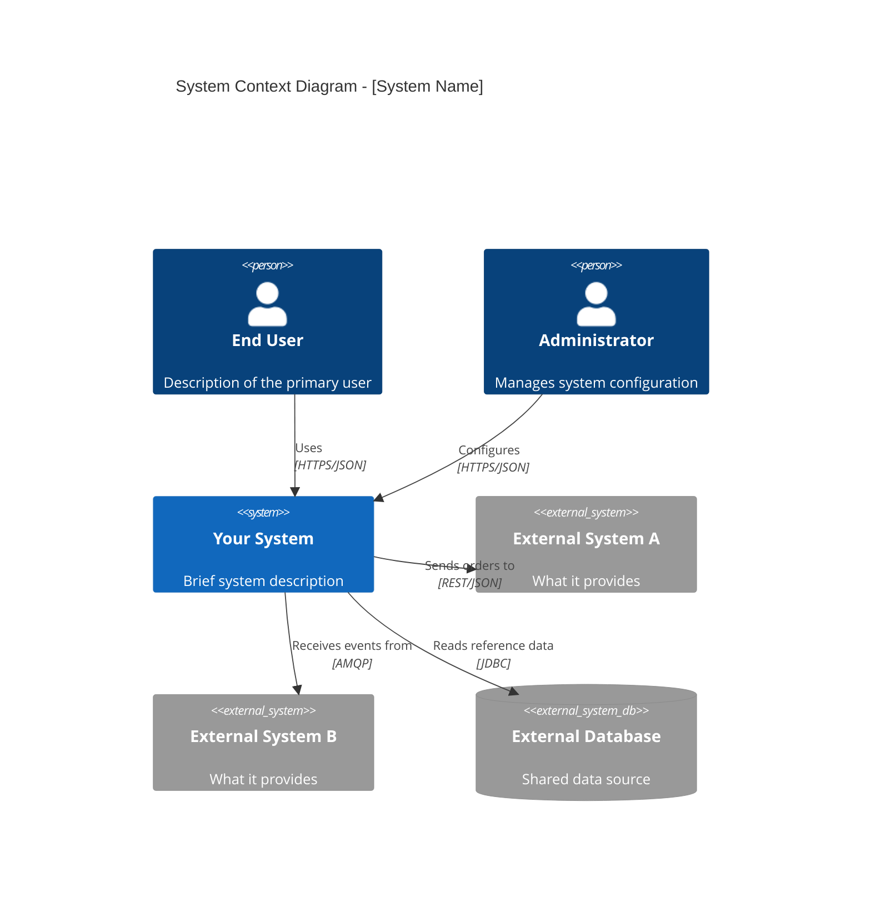
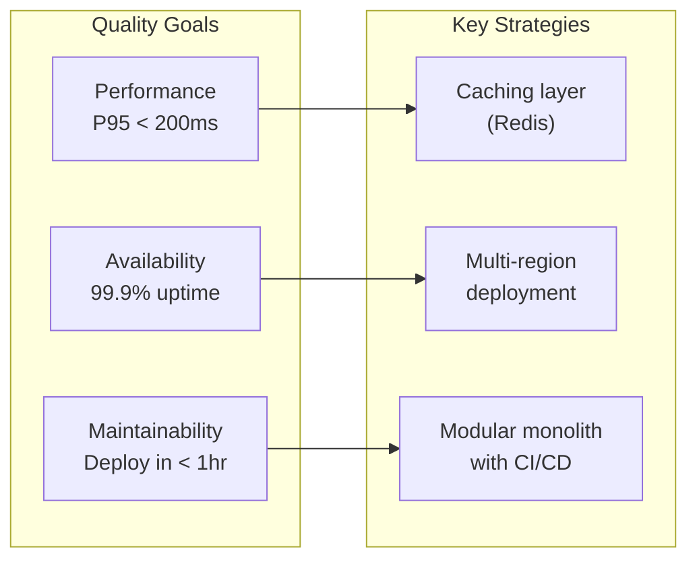
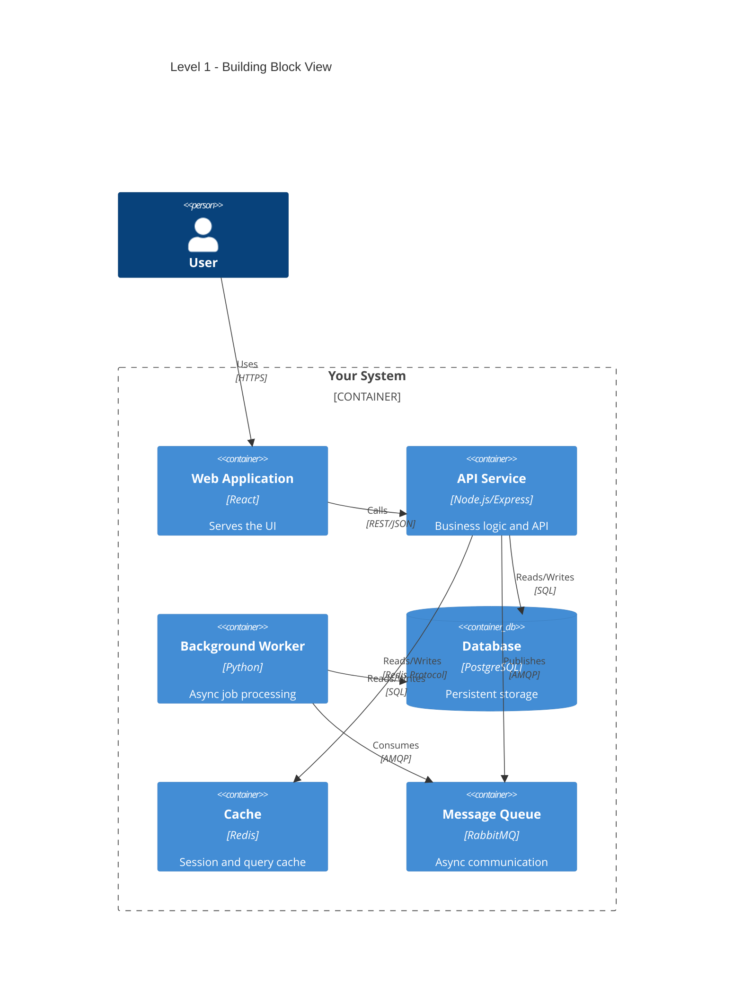
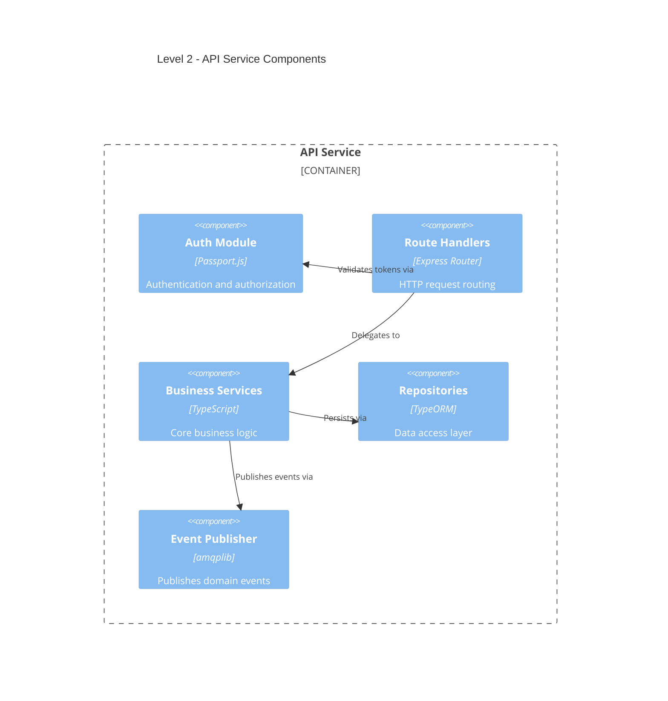
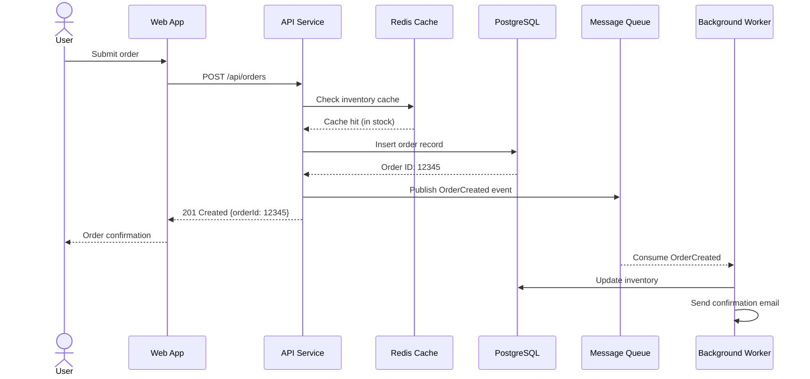
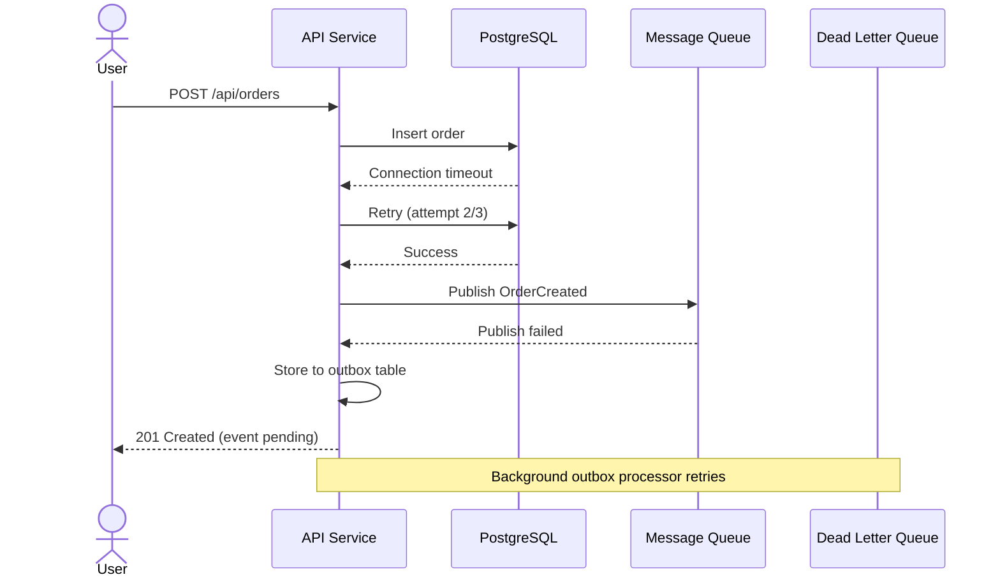
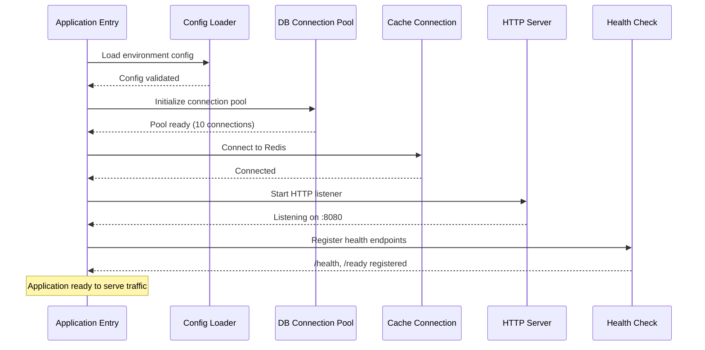
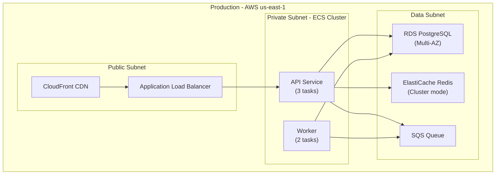
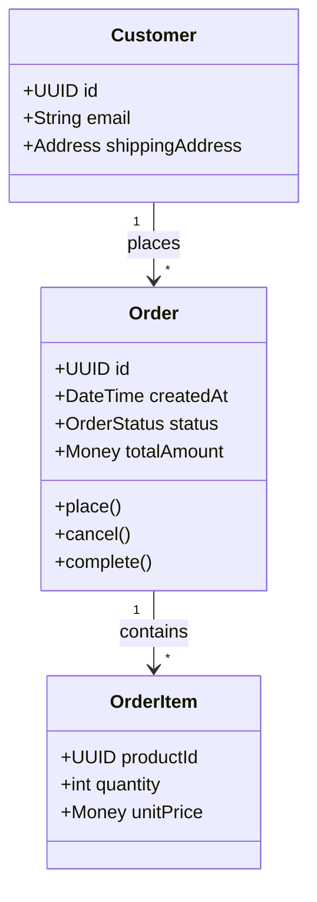
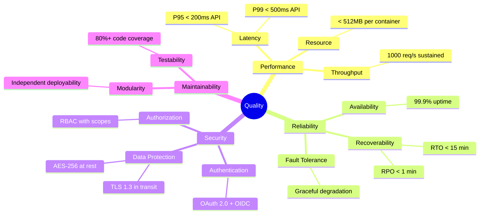

# arc42 Architecture Documentation Template (v9.0)

## What is arc42?

arc42 is a pragmatic, battle-tested template for documenting software and system architecture. Created by Gernot Starke and Peter Hruschka, it has been used in thousands of projects across industries since 2005. Version 9.0 refines the template with clearer guidance and modern tooling support.

**Key characteristics:**

- **12 sections** covering all aspects of architecture documentation, from goals and constraints through runtime behavior to risks and technical debt.
- **Not prescriptive.** Use the sections you need, skip or stub the rest. A three-page arc42 document that gets read is better than a sixty-page document that collects dust.
- **Technology-agnostic.** Works for monoliths, microservices, embedded systems, data pipelines, mobile apps, and anything in between.
- **Tooling-friendly.** Designed for plain-text formats (Markdown, AsciiDoc) with diagram-as-code support (Mermaid, PlantUML, C4).
- **Living documentation.** Intended to be maintained alongside the codebase, not produced once and forgotten.

**When to use arc42:** Any time you need to communicate architectural decisions to current and future team members, stakeholders, auditors, or your future self. It is equally useful for greenfield projects (documenting decisions as you make them) and brownfield projects (reverse-engineering and capturing existing architecture).

---

## Section Guide

Each of the 12 sections below includes its purpose, content guidance, what a codebase-aware tool can auto-infer (marked with the robot icon), what requires human judgment (marked with the person icon), and Mermaid diagram templates where applicable.

---

### Section 1: Introduction and Goals

**Purpose:** Why does this system exist? What are the driving forces? Who cares about it?

This section is the single most important part of your architecture documentation. If someone reads only one section, it should be this one.

**Content guidance:**
- **Requirements overview.** List the top 3-5 functional requirements or use cases that drive architectural decisions. These are not all requirements -- only the architecturally significant ones.
- **Quality goals.** Identify the top 3-5 quality attributes (e.g., performance, security, availability, maintainability) ranked by priority. Use a simple table: Quality Goal | Priority | Motivation.
- **Stakeholders.** Table of stakeholders: Role | Name/Contact | Expectations regarding architecture.

**What can be auto-inferred:**
- Nothing meaningful. This section is inherently about human intent and organizational context.

**What requires human input:**
- All content. Requirements, quality priorities, and stakeholder expectations come from product owners, architects, and business leaders.

**Tips:**
- Keep the requirements overview to one paragraph per requirement. Link to detailed specs elsewhere.
- Quality goals should be concrete. "Performance" is vague. "P95 response time under 200ms for search queries" is actionable.
- Include stakeholders who are not users: operations teams, security reviewers, auditors, future developers.

---

### Section 2: Architecture Constraints

**Purpose:** What are the non-negotiable boundaries the architecture must operate within?

Constraints are decisions already made for you. They limit your design space but also simplify it -- you do not need to evaluate alternatives for constrained choices.

**Content guidance:**
- **Technical constraints.** Mandated technologies (e.g., "must run on AWS," "must use PostgreSQL"), existing systems to integrate with, required platforms or frameworks.
- **Organizational constraints.** Team size and structure, budget limitations, timeline and deadlines, regulatory or compliance requirements.
- **Convention constraints.** Coding standards, documentation requirements, branching strategies, deployment processes.

**What can be auto-inferred:**
- Nothing reliably. Configuration files hint at technology choices, but constraints come from external mandates.

**What requires human input:**
- All content. Constraints are imposed by business, legal, organizational, or contractual forces.

**Tips:**
- Distinguish between real constraints (non-negotiable) and assumptions (believed to be true but could change). Revisit assumptions periodically.
- Record why each constraint exists. When the reason disappears, the constraint may too.

---

### Section 3: Context and Scope

**Purpose:** What is the boundary of the system? What is inside, what is outside, and how do they interact?

This section draws a clear line around your system and identifies every external entity it communicates with.

**Content guidance:**
- **Business context.** Your system as a black box surrounded by users, external systems, and other actors. Focus on what information flows in and out, not how.
- **Technical context.** The same boundary, but now showing technical details: protocols (HTTP, gRPC, AMQP), data formats (JSON, Protobuf, CSV), channels (REST API, message queue, file share).

**What can be auto-inferred:**
- API endpoint definitions (REST routes, GraphQL schemas, gRPC service definitions)
- External service clients (HTTP clients, SDK imports, database connections)
- Configuration files referencing external URLs, hostnames, or service names
- Message queue producers/consumers
- Import statements for third-party SDKs

**What requires human input:**
- The full picture of external system relationships, especially those not visible in code (manual processes, phone calls, email integrations)
- Business-level descriptions of what each external actor does and why
- Data sensitivity classifications for each channel

**Mermaid template -- C4 Context Diagram:**



---

### Section 4: Solution Strategy

**Purpose:** What are the fundamental technology and architecture decisions? What is the overall approach to achieving quality goals?

This is the executive summary of your architecture. A senior engineer joining the team should read this section to understand the big-picture approach.

**Content guidance:**
- **Technology decisions.** Key technology choices and why (language, framework, database, cloud provider, message broker).
- **Decomposition approach.** How is the system broken into parts? (Layered architecture, microservices, modular monolith, hexagonal/ports-and-adapters, event-driven.)
- **Quality attribute strategies.** For each top quality goal from Section 1, briefly state the approach. Example: "Availability: multi-region active-active with automatic failover."
- **Organizational decisions.** Team topology, ownership model, development workflow.

**What can be auto-inferred:**
- Technology choices can be detected from dependency files (package.json, requirements.txt, go.mod, Cargo.toml)
- High-level architecture style can be inferred from directory structure and deployment configs

**What requires human input:**
- The rationale behind each decision
- Quality attribute strategies
- Organizational decisions

**Mermaid template -- Strategy Overview:**



---

### Section 5: Building Block View

**Purpose:** What are the major parts of the system and how do they relate to each other?

This is the structural decomposition of your system, shown at multiple levels of detail. Think of it as a series of zoom levels: Level 1 is the satellite view, Level 2 zooms into a neighborhood, Level 3 zooms into a building.

**Content guidance:**
- **Level 1 (Whitebox of the overall system).** The system decomposed into its top-level modules, services, or components. Each building block gets: name, responsibility (one sentence), interfaces it exposes, interfaces it consumes.
- **Level 2 (Whitebox of selected Level 1 blocks).** Decompose each Level 1 block into its internal components. Only decompose blocks that are complex enough to warrant it.
- **Level 3 (Whitebox of selected Level 2 blocks).** Rarely needed. Reserve for particularly complex or critical components.
- For each building block at every level: **Responsibility** (what it does), **Interfaces** (what it exposes), **Quality/performance characteristics** (if notable), **Open issues** (if any).

**What can be auto-inferred:**
- Module and package structure from directory layout
- Service boundaries from deployment configurations (docker-compose, Kubernetes manifests)
- Interface definitions from API schemas, exported functions, public class/module APIs
- Dependencies between modules from import statements

**What requires human input:**
- The intended responsibility of each building block (not just what it does, but why it exists as a separate unit)
- Rationale for the decomposition choices
- Which Level 2/3 decompositions are worth documenting

**Mermaid template -- Level 1 (C4 Container):**



**Mermaid template -- Level 2 (C4 Component):**



---

### Section 6: Runtime View

**Purpose:** How do the building blocks behave at runtime? What happens when key scenarios execute?

Static structure (Section 5) shows the parts. Runtime view shows the parts in motion -- how they collaborate to fulfill important use cases.

**Content guidance:**
- Select 3-6 architecturally significant scenarios (the ones that exercise the most important or complex interactions).
- For each scenario: **trigger** (what initiates it), **sequence of interactions** between building blocks, **outcome**, **error handling** (what happens when things go wrong).
- Cover at minimum: one happy-path scenario, one error/failure scenario, startup/shutdown if non-trivial, one background/batch process if applicable.

**What can be auto-inferred:**
- Call chains between modules from static code analysis
- Error handling patterns from try/catch structures, error middleware, retry logic
- Startup sequences from main/entry files and initialization code

**What requires human input:**
- Which scenarios are architecturally significant
- Expected behavior vs. implementation details
- Performance expectations for each scenario

**Mermaid template -- Happy Path Scenario:**



**Mermaid template -- Error/Failure Scenario:**



**Mermaid template -- Startup Sequence:**



---

### Section 7: Deployment View

**Purpose:** How does the software map to infrastructure? What runs where?

This section bridges the gap between the logical architecture (building blocks) and the physical world (servers, containers, cloud services).

**Content guidance:**
- **Infrastructure topology.** Servers, containers, cloud services, networks, load balancers.
- **Mapping.** Which building block runs on which infrastructure element.
- **Environments.** Description of each environment (dev, staging, production) and how they differ.
- **Deployment process.** How software gets from a developer's machine to production.

**What can be auto-inferred:**
- Container definitions from Dockerfiles and docker-compose.yml
- Kubernetes topology from manifests (Deployments, Services, Ingress)
- CI/CD pipeline from workflow files (.github/workflows, .gitlab-ci.yml, Jenkinsfile)
- Infrastructure-as-code from Terraform, CloudFormation, Pulumi files
- Environment configurations from env files and config maps

**What requires human input:**
- Production topology details (especially when not fully codified in IaC)
- Network architecture and security zones
- Disaster recovery and failover topology
- Cost considerations driving infrastructure choices

**Mermaid template -- Deployment Diagram:**



---

### Section 8: Crosscutting Concepts

**Purpose:** What patterns and approaches apply across multiple building blocks?

Crosscutting concepts are the architectural decisions that affect the entire system rather than a single building block. They ensure consistency and reduce duplication.

**Content guidance:**
- **Domain model.** Core entities, value objects, aggregates, and their relationships.
- **Persistence strategy.** ORM vs. raw SQL, repository pattern, database-per-service vs. shared database.
- **Error handling.** Error classification, propagation strategy, user-facing error format, retry policies.
- **Logging and monitoring.** Log format, log levels, structured logging, metrics collection, alerting strategy.
- **Security concept.** Authentication method, authorization model (RBAC, ABAC), data encryption (at rest, in transit), secret management.
- **Transaction handling.** ACID transactions, saga pattern, eventual consistency, idempotency.
- **Session handling.** Session storage, token format, session lifecycle.
- **Communication patterns.** Synchronous (REST, gRPC) vs. asynchronous (events, messages), serialization format.

**What can be auto-inferred:**
- Error handling patterns from middleware, exception classes, error response schemas
- Logging patterns from logger configurations and usage
- Authentication middleware and authorization decorators
- ORM models and database schemas
- Message serialization formats

**What requires human input:**
- Why specific patterns were chosen over alternatives
- Security threat model and compliance requirements
- SLA commitments that drive monitoring and alerting decisions

**Mermaid template -- Domain Model:**



---

### Section 9: Architecture Decisions

**Purpose:** What were the key architectural decisions, and why were they made?

Architecture decisions are the most valuable long-term documentation artifact. Code shows what was built. Decisions explain why it was built that way.

**Content guidance:**
- Link to the ADR (Architecture Decision Record) directory if one exists.
- Summary table of key decisions: ID | Title | Status | Date | Consequences.
- For full ADR formatting, see the companion reference `adr-templates.md`.

**What can be auto-inferred:**
- Existing ADR files in the repository (typically in `docs/adr/` or `docs/decisions/`)
- Decision metadata from ADR file front matter

**What requires human input:**
- New decisions that have not yet been recorded
- Context and rationale for past decisions (especially undocumented ones)

**Tips:**
- Record decisions when they are made, not after. The context is freshest at decision time.
- Superseded decisions are still valuable. Do not delete them; mark them as superseded and link to the replacement.
- Not everything needs an ADR. Reserve them for decisions that are hard to reverse, affect multiple teams, or involve significant trade-offs.

---

### Section 10: Quality Requirements

**Purpose:** What are the detailed quality expectations, and how will they be verified?

Section 1 introduced the top quality goals. This section expands them into specific, measurable, testable quality scenarios.

**Content guidance:**
- **Quality tree.** Hierarchical breakdown of quality attributes (e.g., Performance subdivided into throughput, latency, and resource efficiency).
- **Quality scenarios.** For each quality attribute, define concrete scenarios using the format: Source of stimulus -> Stimulus -> Environment -> Artifact -> Response -> Response measure.
- **Priority ranking.** When quality attributes conflict (e.g., security vs. usability), which wins?

**What can be auto-inferred:**
- Nothing meaningful. Quality requirements are inherently about expectations, not implementation.

**What requires human input:**
- All quality scenarios, priorities, and trade-off decisions.

**Mermaid template -- Quality Tree:**



---

### Section 11: Risks and Technical Debt

**Purpose:** What could go wrong, and what shortcuts have we taken?

This section is an honest assessment. Every system has risks and debt. Documenting them is not a sign of failure -- it is a sign of maturity.

**Content guidance:**
- **Known risks.** Each risk described with: description, probability (low/medium/high), impact (low/medium/high), mitigation strategy, owner.
- **Technical debt inventory.** Categorized list of known debt items with estimated effort to resolve and business impact of leaving them.
- **Mitigation strategies.** Concrete plans for addressing the highest-priority risks and debt items.

**What can be auto-inferred:**
- Code complexity metrics (cyclomatic complexity, file sizes, dependency depth)
- Outdated dependency versions and known CVEs
- TODO/FIXME/HACK comments in code
- Test coverage gaps
- Duplicate code detection

**What requires human input:**
- Business risk assessment (probability and impact are judgment calls)
- Prioritization of debt repayment
- External risks (vendor lock-in, key-person dependencies, regulatory changes)

**Tips:**
- Review this section quarterly. Risks and debt change as the system evolves.
- For detailed debt assessment methodology, see the companion reference `technical-debt-assessment.md`.

---

### Section 12: Glossary

**Purpose:** What do the domain-specific terms mean?

Every project develops its own vocabulary. The glossary makes that vocabulary explicit and unambiguous.

**Content guidance:**
- Domain-specific terms with clear definitions.
- Abbreviations and acronyms expanded.
- Terms where the project's usage differs from common industry usage.
- Format: Term | Definition | Source/Context.

**What can be auto-inferred:**
- Entity names and types from domain model code
- Abbreviations used in code (class names, variable names, API endpoints)
- Terms defined in code comments or docstrings

**What requires human input:**
- Precise definitions (code naming is often abbreviated or ambiguous)
- Business context for domain terms
- Disambiguation of overloaded terms

**Tips:**
- Start with terms that cause confusion in code reviews or meetings. Those are the ones that need definitions most.
- Keep it alphabetical. A glossary that is hard to search is not used.

---

## Quick-Start: Minimum Viable arc42

Not every project needs all 12 sections on day one. Start with the four sections that deliver the most value per page:

1. **Section 1: Introduction and Goals.** Why does this system exist and what quality attributes matter most? Without this, every architectural discussion lacks a frame of reference.
2. **Section 3: Context and Scope.** What is inside the system boundary and what is outside? This single diagram prevents more miscommunication than any other artifact.
3. **Section 5: Building Block View (Level 1 only).** What are the 4-8 major parts of the system? This gives new team members a mental model in five minutes.
4. **Section 9: Architecture Decisions.** What were the key choices and why? This prevents re-litigating settled decisions and helps new members understand the trade-offs.

Add other sections incrementally as the need arises. Section 6 (Runtime View) is typically the next most valuable addition, followed by Section 8 (Crosscutting Concepts).

---

## arc42 Output Structure

Store arc42 documentation in a dedicated directory within the project repository:

```
docs/architecture/
├── arc42/
│   ├── 01-introduction-and-goals.md
│   ├── 02-constraints.md
│   ├── 03-context-and-scope.md
│   ├── 04-solution-strategy.md
│   ├── 05-building-block-view.md
│   ├── 06-runtime-view.md
│   ├── 07-deployment-view.md
│   ├── 08-crosscutting-concepts.md
│   ├── 09-architecture-decisions.md
│   ├── 10-quality-requirements.md
│   ├── 11-risks-and-technical-debt.md
│   └── 12-glossary.md
```

**Conventions:**
- Each file is self-contained with a level-1 heading matching the section name.
- Mermaid diagrams are embedded inline using fenced code blocks.
- Cross-references between sections use relative Markdown links.
- Large sections (especially Section 5 with multiple levels) may be split into subdirectories: `05-building-block-view/level-1.md`, `05-building-block-view/level-2-api-service.md`, etc.
- Images and exported diagrams go in `docs/architecture/arc42/images/`.
- The arc42 document is a living artifact. Update it as part of the definition of done for architectural changes, not as a separate documentation task.
