# Architecture Patterns Reference

A comprehensive catalog of software architecture patterns with selection guidance, combination strategies, and 2026 industry trend analysis. This reference is designed for use during architectural decision-making, trade-off analysis, and system design sessions.

---

## Pattern Catalog

### 1. Modular Monolith

**Description:** A single deployable unit organized into well-defined modules with explicit boundaries enforced at compile time or through build tooling. Modules communicate through published interfaces rather than direct internal calls. The database is shared but each module owns its schema or set of tables.

**When to use:**
- Team size is under 20 engineers
- The product domain is well-understood but boundaries may shift
- You want strong consistency without distributed transaction complexity
- Deployment simplicity is valued over independent scaling

**When to avoid:**
- Different modules have radically different scaling profiles
- Teams need fully independent deployment pipelines
- The organization has strong Conway's Law pressure toward separate services

**Quality attribute impact:**
- Helps: Maintainability, Debuggability, Consistency, Development velocity (early stage)
- Hurts: Independent scalability, Independent deployability, Fault isolation

**2026 adoption signal:** 42% of organizations that adopted microservices are consolidating back toward modular monoliths. Shopify's modular monolith handling $billions in GMV is a frequently cited success story. The pattern is now seen as the default starting point rather than an intermediate step.

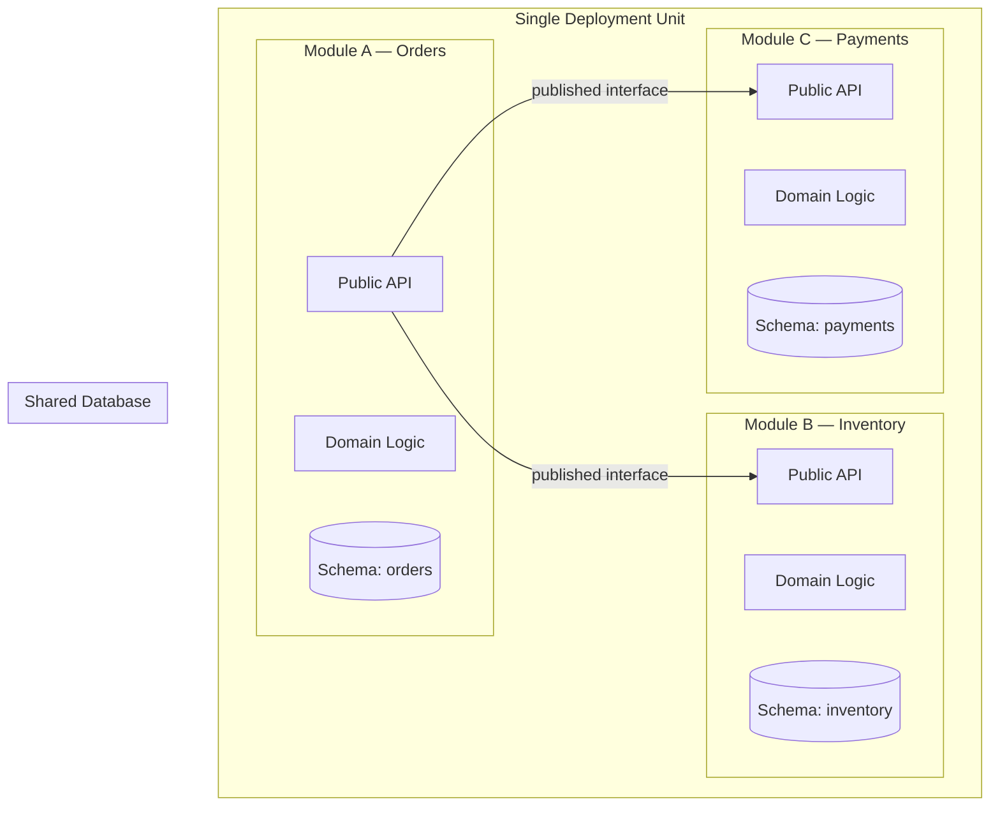

---

### 2. Microservices

**Description:** An architectural style where the application is composed of small, independently deployable services, each owning its data store and communicating via well-defined APIs or asynchronous events. Each service is organized around a business capability and can be developed, deployed, and scaled independently by a dedicated team.

**When to use:**
- Organization has 20+ engineers across multiple teams
- Different components have vastly different scaling or availability requirements
- Teams need to release independently on different cadences
- Polyglot technology choices are required per domain

**When to avoid:**
- Team is small (under 10 engineers) and does not need independent deployment
- Domain boundaries are unclear or rapidly shifting
- The organization lacks platform engineering maturity (CI/CD, observability, service discovery)
- Strong transactional consistency is required across many services

**Quality attribute impact:**
- Helps: Scalability, Independent deployability, Fault isolation, Team autonomy
- Hurts: Operational complexity, Debugging/tracing, Data consistency, Latency (network hops)

**2026 adoption signal:** Microservices remain dominant at scale but the pendulum has swung. Industry consensus now emphasizes "right-sizing" services rather than maximizing decomposition. The term "macroservices" (larger, capability-aligned services rather than fine-grained ones) is gaining traction.

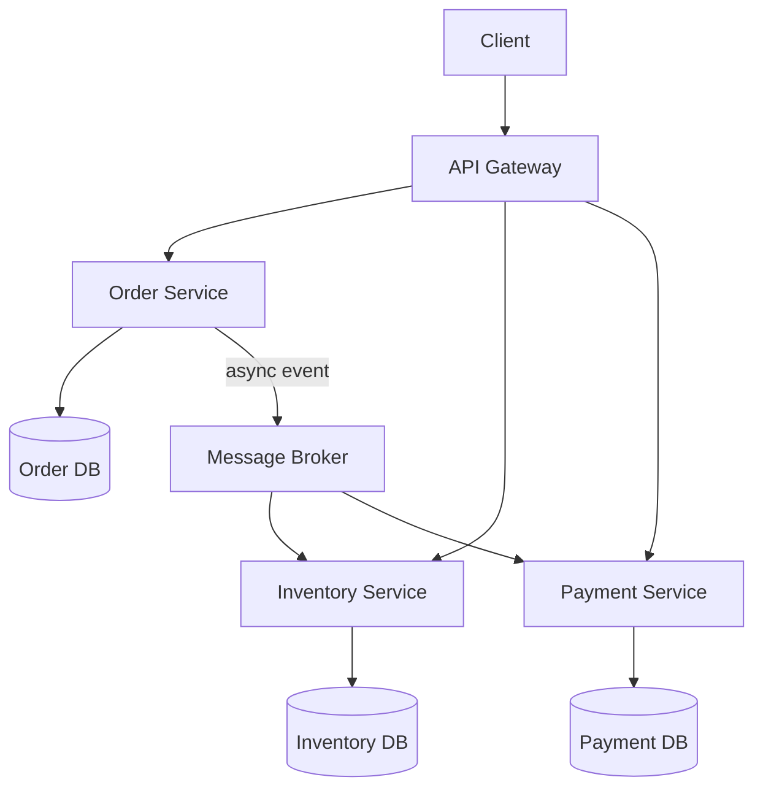

---

### 3. Cell-Based Architecture

**Description:** The system is decomposed into self-contained cells, each containing a full vertical slice of functionality including its own compute, storage, and networking. Cells are independent failure domains; a failure in one cell does not propagate to others. A routing layer directs traffic to the appropriate cell based on partitioning keys such as tenant ID or region.

**When to use:**
- Multi-tenant SaaS with strict blast-radius requirements
- Regulatory requirements demand data residency or isolation guarantees
- System must survive regional or zonal failures gracefully
- Operating at massive scale where even microservice failure cascades are unacceptable

**When to avoid:**
- Small-scale applications without multi-tenancy
- Systems where cross-cell data access is frequently required
- Teams lack the platform maturity to manage cell provisioning and routing
- Cost sensitivity prohibits the infrastructure duplication inherent in cells

**Quality attribute impact:**
- Helps: Fault isolation, Blast radius containment, Compliance/data residency, Scalability
- Hurts: Cost (infrastructure duplication), Cross-cell queries, Operational complexity

**2026 adoption signal:** Cell-based architecture is the breakout pattern of 2025-2026. AWS re:Invent 2025 featured multiple talks on cell-based design. DoorDash, Slack, and Roblox have published detailed accounts of their cell-based migrations. Gartner now lists it as a "high impact" pattern.

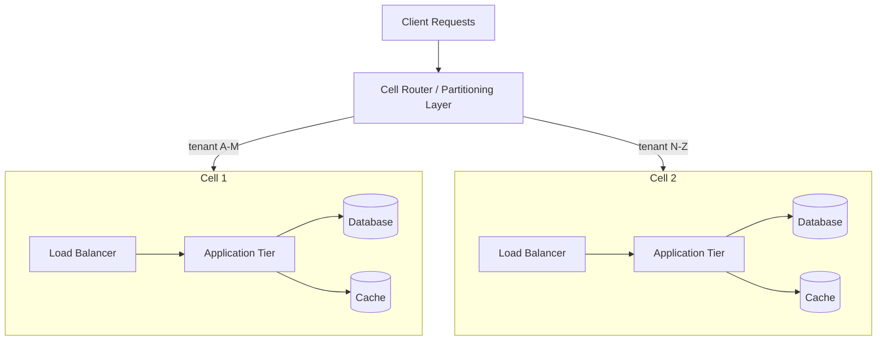

---

### 4. Event-Driven Architecture

**Description:** A pattern where the production, detection, consumption, and reaction to events are central to the system's design. Components communicate by emitting and reacting to events rather than through direct request-response calls. This decouples producers from consumers and enables reactive, asynchronous workflows.

**When to use:**
- Workflows span multiple services and benefit from loose coupling
- Real-time or near-real-time processing is required
- The system needs to react to state changes across domain boundaries
- Audit trails and temporal reasoning are important

**When to avoid:**
- Simple CRUD applications without cross-cutting workflows
- Strong request-response semantics are needed with immediate consistency
- The team lacks experience with eventual consistency debugging
- Message ordering guarantees are critical and hard to achieve with chosen infrastructure

**Quality attribute impact:**
- Helps: Loose coupling, Scalability, Extensibility (add consumers without modifying producers), Resilience
- Hurts: Debuggability (tracing event flows), Consistency (eventual by nature), Complexity of error handling

**2026 adoption signal:** Event-driven architecture is mature and widespread. Apache Kafka, AWS EventBridge, and Google Pub/Sub remain dominant. The trend in 2026 is toward "event mesh" topologies and standardized event schemas via CloudEvents and AsyncAPI specifications.

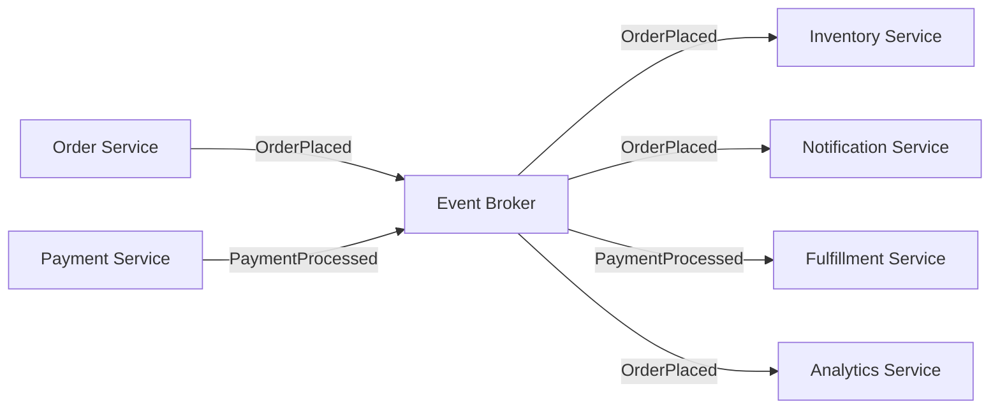

---

### 5. CQRS (Command Query Responsibility Segregation)

**Description:** The system separates the write model (commands that change state) from the read model (queries that return data). The write side processes business logic and persists changes. The read side maintains optimized projections tailored to specific query patterns, updated asynchronously from the write side.

**When to use:**
- Read and write workloads have vastly different scaling or performance requirements
- Complex domain logic on the write side but simple, denormalized reads
- Multiple read representations of the same data are needed (e.g., list view, search index, report)
- Combined with Event Sourcing for full auditability

**When to avoid:**
- Simple domains where read and write models are nearly identical
- The team is unfamiliar with eventual consistency trade-offs
- The added complexity of maintaining projections is not justified by the workload

**Quality attribute impact:**
- Helps: Read performance, Write performance (independent optimization), Scalability, Flexibility of read models
- Hurts: Consistency (eventual between write and read), Complexity, Data duplication

**2026 adoption signal:** CQRS is well-established as a tactical pattern. It is increasingly used in combination with AI-native architectures where the read side feeds vector stores and embedding indexes for RAG systems.

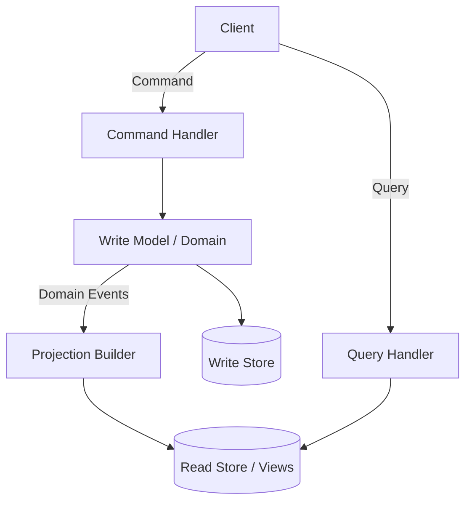

---

### 6. Event Sourcing

**Description:** Instead of storing the current state of an entity, all changes are captured as an immutable, append-only sequence of events. The current state is derived by replaying the event stream. This provides a complete audit trail, enables temporal queries ("what was the state at time T?"), and allows rebuilding projections from history.

**When to use:**
- Full audit trail is a regulatory or business requirement
- Temporal queries are needed (replay, point-in-time state)
- The domain benefits from understanding how state was reached, not just what it is
- Combined with CQRS for read-side projections

**When to avoid:**
- Simple CRUD where history is irrelevant
- Domains with frequent updates to the same entity (event streams become very long)
- Teams unfamiliar with event replay, snapshotting, and schema evolution
- Hard delete requirements conflict with append-only semantics

**Quality attribute impact:**
- Helps: Auditability, Temporal queries, Debugging (replay), Decoupling (events drive projections)
- Hurts: Query complexity (must build projections), Storage growth, Event schema evolution difficulty

**2026 adoption signal:** Event sourcing adoption is steady in domains requiring auditability (finance, healthcare, compliance). EventStoreDB and Axon Framework remain the primary purpose-built tools. The pattern is increasingly used to feed AI training pipelines with historical behavioral data.

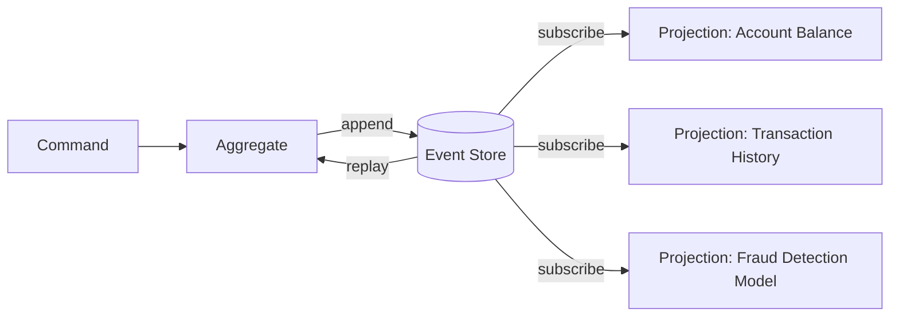

---

### 7. Hexagonal Architecture (Ports & Adapters)

**Description:** The application's core domain logic is placed at the center, completely isolated from external concerns. The domain interacts with the outside world through ports (interfaces defined by the domain) and adapters (implementations that connect to specific technologies like databases, APIs, or message brokers). Dependencies always point inward.

**When to use:**
- The domain logic is complex and must be testable in isolation
- You need to swap infrastructure components (e.g., switch databases, message brokers)
- Long-lived systems where technology choices will evolve
- Applying domain-driven design principles

**When to avoid:**
- Simple applications with trivial business logic
- Prototypes or throwaway code where the indirection overhead is not justified
- Teams unfamiliar with dependency inversion principles

**Quality attribute impact:**
- Helps: Testability, Maintainability, Technology independence, Domain clarity
- Hurts: Initial development speed (more interfaces and wiring), Learning curve

**2026 adoption signal:** Hexagonal architecture is now the default internal structure for well-designed services. It pairs naturally with AI-native patterns where LLM providers and vector stores are treated as adapters behind ports, enabling easy swaps between providers.

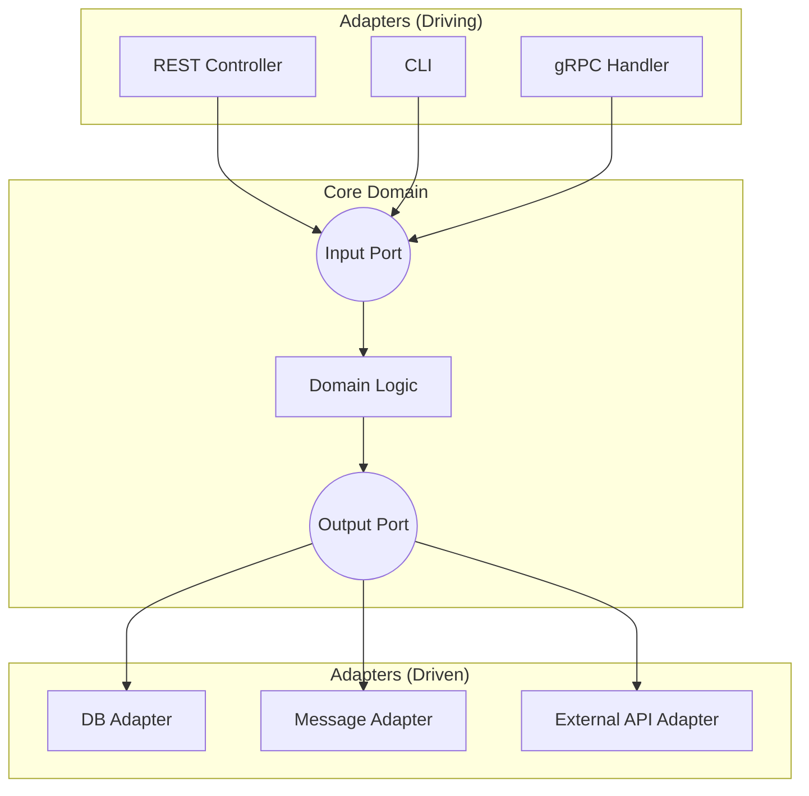

---

### 8. Clean Architecture

**Description:** A layered architecture where the dependency rule states that source code dependencies must point inward — outer layers depend on inner layers, never the reverse. The innermost layer contains enterprise business rules (entities), surrounded by application use cases, then interface adapters, and finally frameworks and drivers at the outermost ring.

**When to use:**
- The system has complex business rules that must remain stable as frameworks change
- Long-lived enterprise applications where framework lock-in is a risk
- Teams want clear separation between "what the system does" and "how it does it"
- The project will be maintained by multiple teams over many years

**When to avoid:**
- Small applications or microservices with minimal business logic
- Rapid prototyping where speed matters more than structure
- When the overhead of layer boundaries slows down a small team

**Quality attribute impact:**
- Helps: Maintainability, Testability, Framework independence, Longevity
- Hurts: Initial velocity, Boilerplate code, Over-engineering risk for simple systems

**2026 adoption signal:** Clean Architecture principles are widely taught and applied. The trend is toward pragmatic adoption — applying the dependency rule rigorously at module boundaries but allowing shortcuts within small modules to avoid excessive indirection.

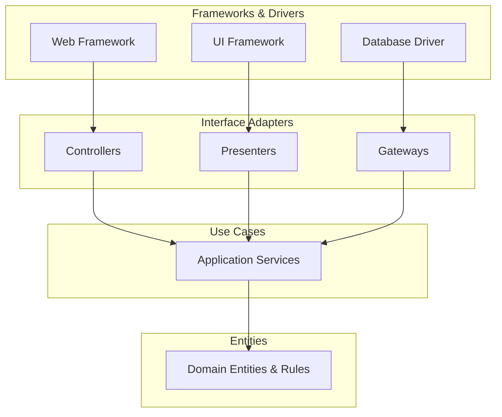

---

### 9. Saga Pattern

**Description:** Manages distributed transactions across multiple services by decomposing them into a sequence of local transactions. Each service performs its local transaction and publishes an event. If a step fails, compensating transactions are executed to undo previous steps. Can be implemented as choreography (event-driven, no central coordinator) or orchestration (a saga coordinator directs the steps).

**When to use:**
- Business transactions span multiple services with independent data stores
- You cannot use traditional distributed transactions (2PC) due to availability or scalability concerns
- Each step has a well-defined compensating action
- The business process has a clear sequence of steps

**When to avoid:**
- Transactions that can be handled within a single service
- Scenarios where compensating transactions are impractical or impossible
- When the number of steps is very large (saga complexity grows with steps)
- Strong consistency is an absolute requirement

**Quality attribute impact:**
- Helps: Availability (no locks across services), Scalability, Resilience
- Hurts: Complexity (compensating transactions), Consistency (temporary inconsistency), Debugging

**2026 adoption signal:** Saga orchestration frameworks (Temporal, Azure Durable Functions, AWS Step Functions) have matured significantly. Temporal in particular has become the de facto standard for saga orchestration in 2026, with adoption growing across startups and enterprises alike.

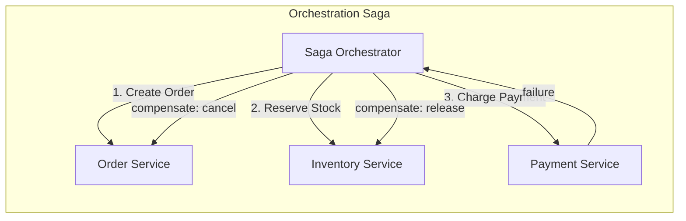

---

### 10. Strangler Fig

**Description:** A migration pattern for incrementally replacing a legacy system. New functionality is built alongside the old system, and a routing layer (often an API gateway or reverse proxy) gradually directs traffic from old endpoints to new implementations. The legacy system "withers" as more traffic is routed away until it can be decommissioned entirely.

**When to use:**
- Migrating from a legacy monolith to a new architecture
- The legacy system cannot be rewritten all at once (too risky, too expensive)
- Business must continue operating during migration with zero downtime
- Features can be decomposed and migrated independently

**When to avoid:**
- The legacy system is small enough to rewrite in one effort
- No clear seams exist to separate functionality
- The routing layer would introduce unacceptable latency or complexity

**Quality attribute impact:**
- Helps: Risk reduction (incremental migration), Business continuity, Gradual modernization
- Hurts: Temporary complexity (two systems running), Routing layer overhead, Extended timeline

**2026 adoption signal:** Strangler Fig remains the standard approach for legacy modernization. In 2026, AI-assisted code analysis tools are accelerating the identification of migration seams, reducing the planning phase from months to weeks.

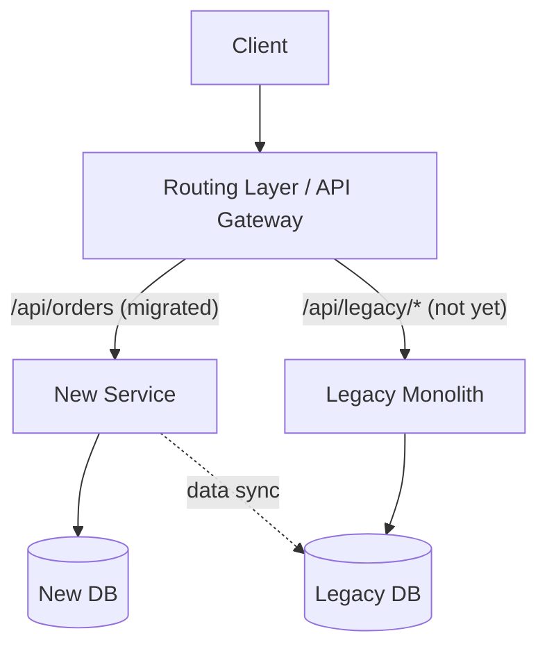

---

### 11. Backend for Frontend (BFF)

**Description:** A dedicated backend service is created for each distinct frontend experience (web, mobile, smart TV, voice assistant). Each BFF aggregates data from downstream services, applies presentation-specific logic, and exposes an API tailored to its frontend's needs. This avoids a single general-purpose API that must serve all clients with different requirements.

**When to use:**
- Multiple frontends with significantly different data and interaction needs
- Mobile apps need smaller payloads while web apps need richer responses
- Frontend teams want autonomy over their backend API shape
- Different frontends have different authentication or caching strategies

**When to avoid:**
- Only one frontend type exists
- All frontends consume nearly identical API shapes
- The overhead of maintaining multiple BFFs exceeds the benefit

**Quality attribute impact:**
- Helps: Frontend performance (tailored payloads), Team autonomy, API clarity per platform
- Hurts: Code duplication across BFFs, Maintenance overhead, Consistency across platforms

**2026 adoption signal:** BFF remains standard practice in organizations with diverse clients. The pattern is evolving with GraphQL federation reducing the need for separate BFFs in some cases, though dedicated BFFs persist for mobile-specific optimizations.

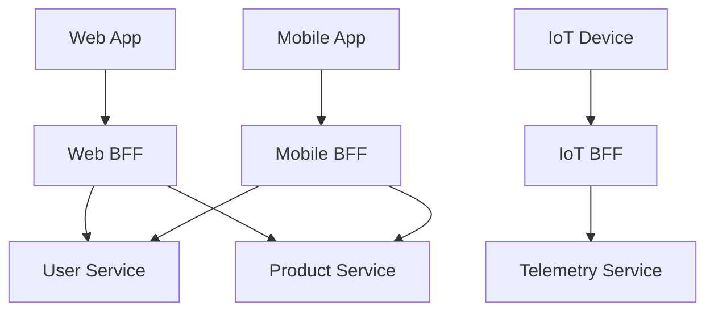

---

### 12. API Gateway

**Description:** A single entry point for all client requests that provides cross-cutting functionality such as authentication, authorization, rate limiting, request routing, protocol translation, and response caching. The gateway abstracts the internal service topology from external clients and can perform request aggregation to reduce round trips.

**When to use:**
- Multiple backend services need a unified external API
- Cross-cutting concerns (auth, rate limiting, logging) should be centralized
- Clients should not need to know about internal service decomposition
- Protocol translation is needed (e.g., REST to gRPC)

**When to avoid:**
- A single monolithic backend serves all requests (the gateway adds latency without benefit)
- The gateway becomes a single point of failure without proper redundancy
- Business logic creeps into the gateway (it should remain infrastructure-only)

**Quality attribute impact:**
- Helps: Security (centralized auth), Simplicity for clients, Observability, Cross-cutting concerns
- Hurts: Latency (additional hop), Single point of failure risk, Potential bottleneck at scale

**2026 adoption signal:** API gateways are ubiquitous. The 2026 trend is "AI-aware gateways" that handle LLM-specific concerns: token-based rate limiting, prompt injection detection, model routing, and streaming response handling. Kong, Envoy, and cloud-native gateways (AWS API Gateway, Google Apigee) lead the market.

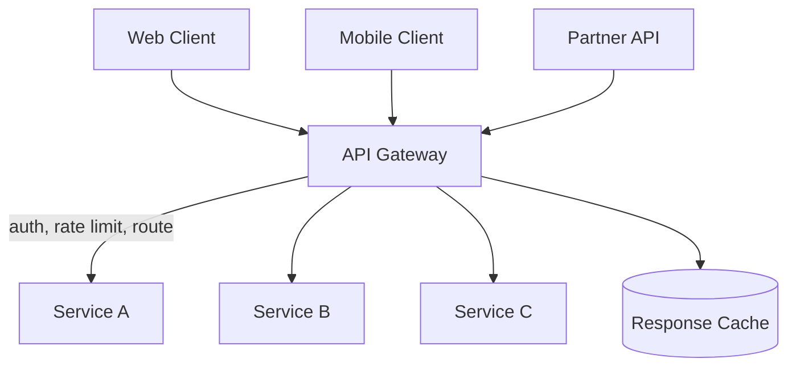

---

### 13. Sidecar / Service Mesh

**Description:** Cross-cutting concerns such as service discovery, load balancing, mutual TLS, retries, circuit breaking, and observability are extracted from application code and placed into a sidecar proxy that runs alongside each service instance. A service mesh is the coordinated deployment of sidecars across all services, managed by a control plane that configures policies centrally.

**When to use:**
- Many services share the same cross-cutting infrastructure needs
- Polyglot services make it impractical to embed these concerns in each language's code
- Consistent security policies (mTLS, authorization) must be enforced across all services
- Fine-grained traffic management (canary deployments, traffic splitting) is required

**When to avoid:**
- Small number of services where the mesh overhead is unjustified
- Latency-sensitive paths where sidecar proxy overhead is unacceptable
- The team lacks Kubernetes or container orchestration expertise
- Simple deployments where a load balancer suffices

**Quality attribute impact:**
- Helps: Security (mTLS everywhere), Observability, Consistency of infrastructure policies, Traffic control
- Hurts: Latency (proxy hop), Resource consumption (sidecar per pod), Operational complexity, Debugging

**2026 adoption signal:** Istio and Linkerd remain the dominant service meshes but "sidecar-less" or "ambient" mesh modes (e.g., Istio ambient mesh, Cilium service mesh using eBPF) are gaining momentum in 2026, reducing the resource overhead that has been the primary criticism of the pattern.

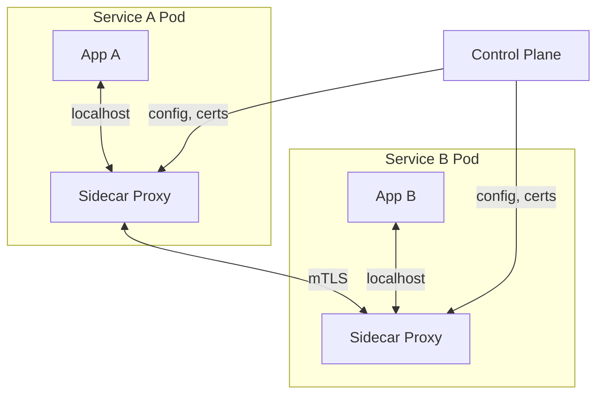

---

### 14. Data Mesh

**Description:** A sociotechnical approach to data architecture that applies domain-driven design principles to data. Each domain team owns its data as a product, exposes it through well-defined interfaces (data contracts), and ensures it meets quality and discoverability standards. A federated governance model provides interoperability without centralized bottlenecks.

**When to use:**
- Large organizations with multiple domains generating and consuming data
- Central data teams are bottlenecks for data access and transformation
- Domain teams have the expertise to manage their own data products
- Self-serve data infrastructure (a data platform) can be provided

**When to avoid:**
- Small organizations with a single data team that can manage everything
- Domains lack the maturity or resources to own data products
- Regulatory requirements mandate centralized data governance
- The organization lacks platform engineering capabilities to provide self-serve infrastructure

**Quality attribute impact:**
- Helps: Scalability of data operations, Domain autonomy, Data quality (ownership accountability), Time-to-value for data
- Hurts: Governance complexity, Cross-domain query difficulty, Duplication, Requires organizational change

**2026 adoption signal:** Data mesh has moved from hype to pragmatic adoption. Most implementations are hybrid: domain ownership for operational data with a centralized analytical layer. Data contracts (enforced schemas for data products) have become the practical entry point for organizations adopting data mesh incrementally.

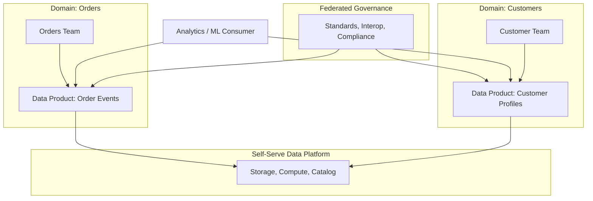

---

### 15. AI-Native Architecture

**Description:** An architectural pattern where AI/LLM capabilities are treated as first-class architectural components rather than bolted-on features. The system is designed around AI interaction patterns including tool use, retrieval-augmented generation (RAG), evaluation loops, guardrails, and agent orchestration. The architecture explicitly addresses prompt management, model routing, context management, and AI observability.

**When to use:**
- AI/LLM capabilities are core to the product's value proposition
- The system requires agentic behavior (multi-step reasoning, tool use, planning)
- RAG is needed to ground LLM responses in domain-specific data
- Guardrails, content filtering, and output validation are required
- Multiple models must be routed to based on task complexity or cost

**When to avoid:**
- AI is a minor feature that can be handled by a simple API call
- The domain does not benefit from natural language understanding or generation
- Regulatory constraints prevent use of LLMs on the data

**Quality attribute impact:**
- Helps: User experience (natural interaction), Automation, Adaptability
- Hurts: Determinism (LLM outputs are probabilistic), Cost (token usage), Latency (inference time), Testability

**2026 adoption signal:** AI-native architecture is the defining emerging pattern of 2026. Every major cloud provider offers agent frameworks (Google ADK, AWS Bedrock Agents, Azure AI Agent Service). Open-source frameworks (LangChain, LlamaIndex, Pydantic AI, CrewAI) provide building blocks. The challenge has shifted from "how to call an LLM" to "how to architect reliable, observable, cost-effective AI systems."

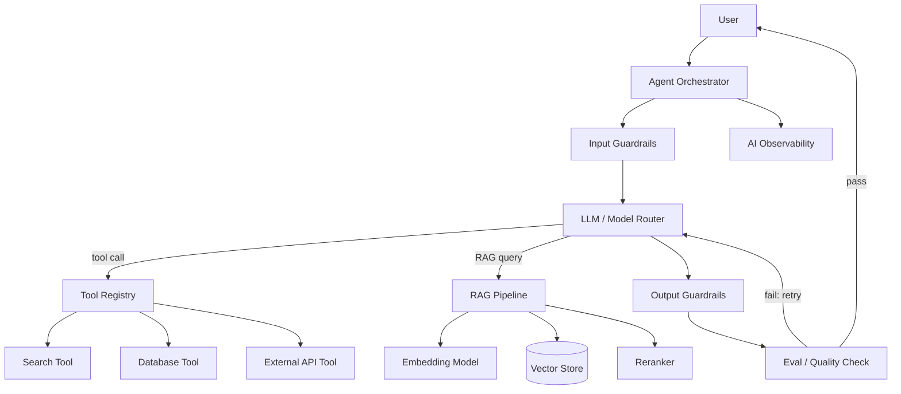

---

### 16. Platform Engineering

**Description:** An organizational and architectural pattern where a dedicated platform team builds and maintains an Internal Developer Platform (IDP) that provides self-service capabilities for application teams. The platform offers golden paths (pre-configured, opinionated workflows for common tasks), standardized infrastructure provisioning, CI/CD pipelines, observability stacks, and security baselines. Application teams consume the platform to ship faster without managing infrastructure directly.

**When to use:**
- Organization has 5+ application teams sharing common infrastructure needs
- Developers spend significant time on undifferentiated infrastructure work
- Inconsistent practices across teams cause reliability or security issues
- The organization wants to shift left on security, compliance, and operational best practices

**When to avoid:**
- Small organizations (under 20 engineers) where a dedicated platform team is impractical
- Every team's infrastructure needs are radically different with no common ground
- The organization lacks executive buy-in to invest in internal tooling

**Quality attribute impact:**
- Helps: Developer productivity, Consistency, Security baseline, Time-to-production, Compliance
- Hurts: Flexibility (golden paths may feel constraining), Platform team becomes a bottleneck if under-resourced

**2026 adoption signal:** Gartner predicts 80% of software engineering organizations will have platform teams by 2026. Backstage (Spotify) is the dominant IDP framework. The trend is toward AI-augmented platforms that auto-generate infrastructure configurations, suggest optimizations, and provide natural-language infrastructure queries.

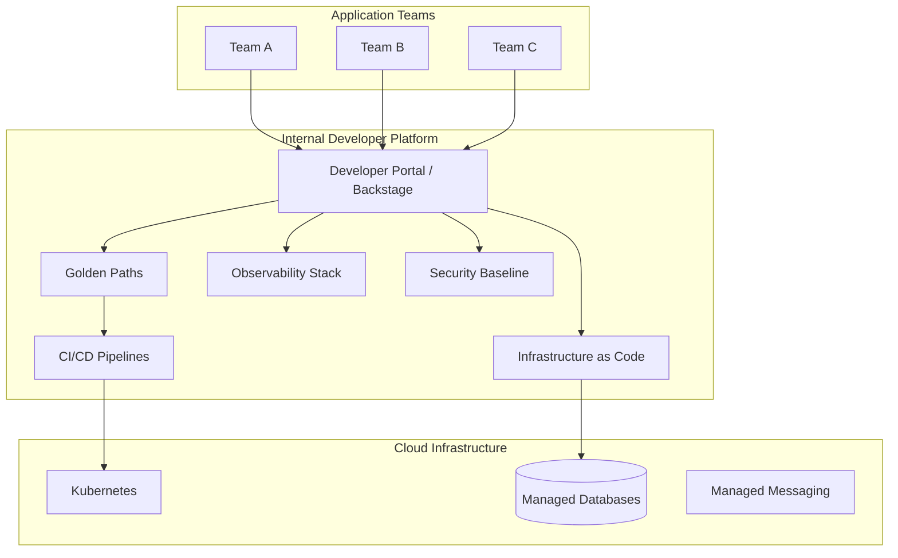

---

## Pattern Selection Decision Tree

Use the following decision tree to guide pattern selection based on key architectural drivers. Start at the top and follow the branches based on your system's requirements.

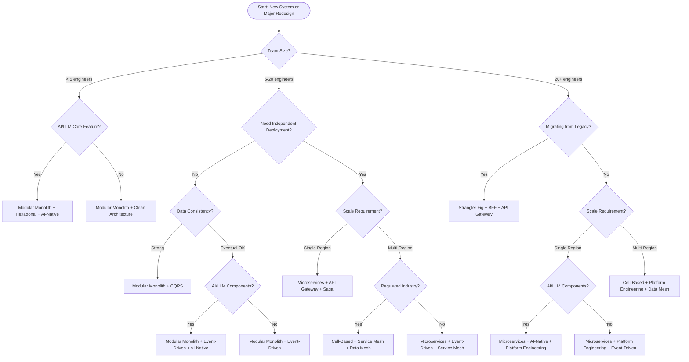

---

## Pattern Combination Guide

Patterns rarely exist in isolation. The following combinations are battle-tested and complement each other well.

### Combination 1: Modular Monolith + Hexagonal + CQRS

**Scenario:** Medium-complexity application with a single team, rich domain logic, and read-heavy workloads.

**How they fit together:** The modular monolith provides the deployment simplicity. Hexagonal architecture structures each module internally so that domain logic is testable and infrastructure-swappable. CQRS optimizes the read path without complicating the write path, with projections built within the same deployment unit.

**Ideal for:** SaaS products in early-to-mid growth, internal enterprise tools, content management systems.

### Combination 2: Microservices + Event-Driven + Saga

**Scenario:** Large-scale distributed system where business processes span multiple services and require compensating transactions.

**How they fit together:** Microservices provide independent deployment and scaling. Event-driven communication decouples services and enables reactive workflows. The saga pattern manages distributed transactions across services with clear compensating actions, typically orchestrated via Temporal or Step Functions.

**Ideal for:** E-commerce order processing, financial transaction systems, supply chain management.

### Combination 3: Cell-Based + Service Mesh + Data Mesh

**Scenario:** Multi-tenant platform operating at massive scale with strict isolation and compliance requirements.

**How they fit together:** Cell-based architecture provides blast-radius containment per tenant or region. The service mesh handles inter-service communication within and across cells with consistent security policies. Data mesh ensures each domain within a cell owns its data products with federated governance across cells.

**Ideal for:** Multi-tenant SaaS at scale, global platforms with data residency requirements, regulated industries (finance, healthcare).

### Combination 4: AI-Native + Hexagonal + Event-Driven

**Scenario:** System where AI/LLM capabilities are core to the product, requiring clean separation of AI infrastructure from domain logic and asynchronous processing of AI workloads.

**How they fit together:** AI-native patterns define the agent orchestration, RAG pipeline, and guardrails. Hexagonal architecture ensures the domain core does not depend on specific LLM providers or vector stores — these are adapters behind ports. Event-driven architecture handles async AI workloads (embedding generation, batch inference, evaluation) without blocking the request path.

**Ideal for:** AI-powered products, intelligent automation platforms, conversational AI systems, AI-augmented developer tools.

---

## 2026 Trend Analysis

### The Monolith Renaissance

42% of organizations that adopted microservices between 2018-2023 are consolidating services back into modular monoliths or "macroservices." The primary drivers are operational complexity reduction, cost savings (fewer containers, less inter-service communication overhead), and improved developer experience. This does not mean microservices are dead — it means the industry is converging on right-sizing services based on actual need rather than defaulting to fine-grained decomposition.

### Cell-Based Architecture Goes Mainstream

Cell-based architecture has moved from a niche pattern used by hyperscalers (AWS, Google) to active adoption at DoorDash, Slack, Roblox, and a growing number of mid-scale SaaS companies. The key driver is blast-radius containment: a failure in Cell 1 does not affect Cell 2. As multi-tenant SaaS becomes the default delivery model, cell-based isolation is becoming a competitive differentiator and, in regulated industries, a compliance requirement.

### AI-Native as a First-Class Architectural Concern

In 2026, AI is no longer a feature bolted onto existing architectures. Organizations are designing systems with AI as a foundational capability. This means architectures must account for: model routing and fallback strategies, token cost management and budgeting, prompt versioning and management, RAG pipelines as core infrastructure, evaluation and guardrail loops as part of the request path, and AI-specific observability (token usage, latency per model, hallucination rates). Frameworks like Google ADK, Pydantic AI, and LangGraph provide the building blocks, but the architectural decisions — how to structure agent hierarchies, where to place guardrails, how to manage context windows — remain the architect's responsibility.

### Platform Engineering Reaches Maturity

Platform engineering has moved from a buzzword to an organizational necessity. With 80% of software engineering organizations expected to have platform teams by end of 2026, the focus is shifting from "should we build a platform?" to "how do we measure platform effectiveness?" Key metrics include time-to-first-deployment for new services, DORA metrics improvement, and developer satisfaction scores. Backstage remains the dominant framework, but AI-augmented platforms that auto-generate configurations and provide natural-language infrastructure queries are the new frontier.
