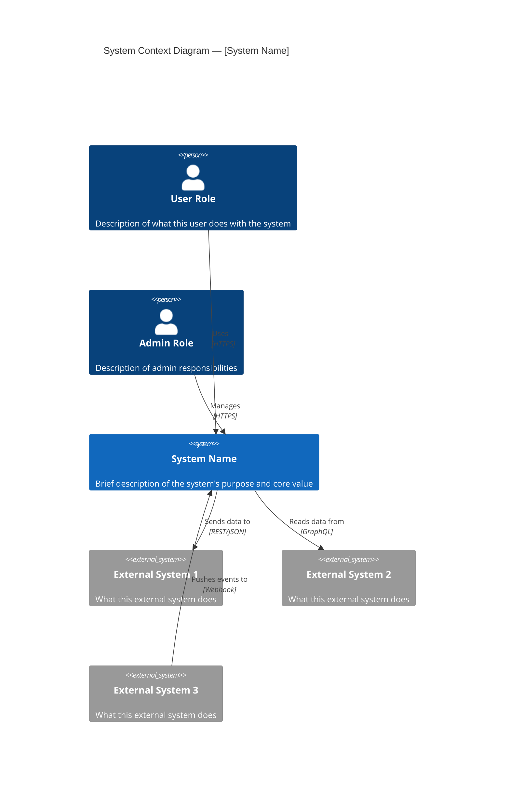
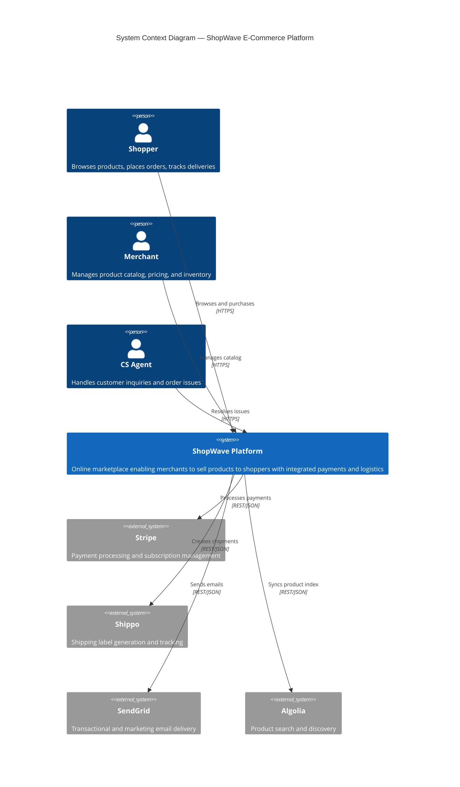
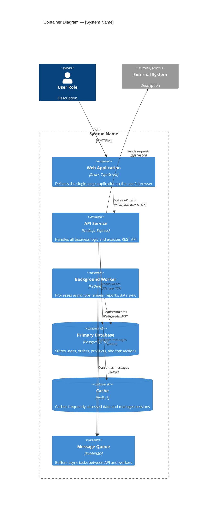
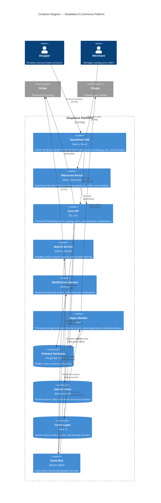
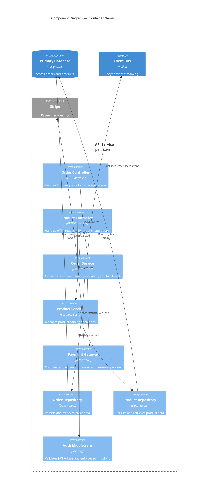
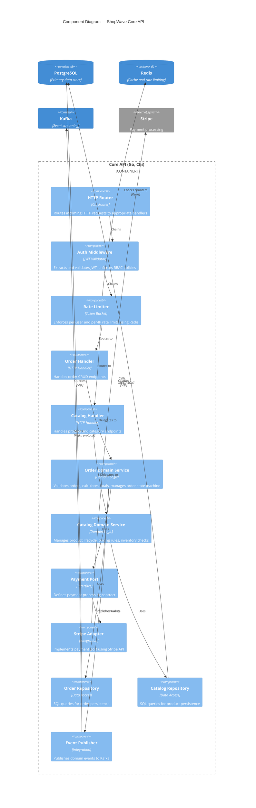
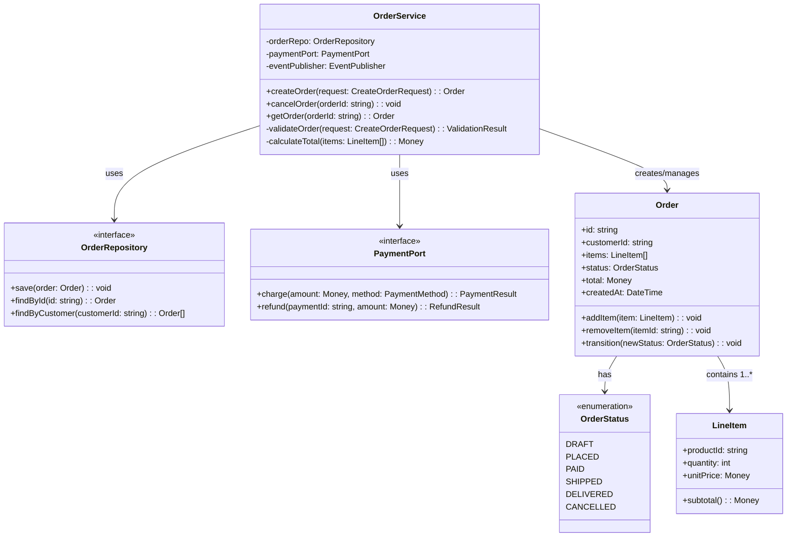
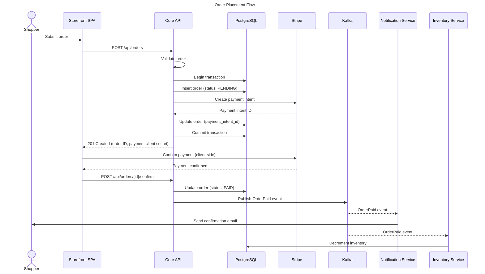
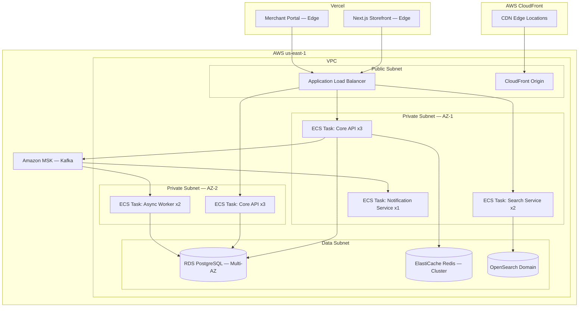

# C4 Diagramming Reference

A comprehensive guide to the C4 model for software architecture visualization, with copy-paste-ready Mermaid templates for all four levels plus supplementary diagrams. This reference covers purpose, audience, templates, examples, quality checklists, and common mistakes for each diagram level.

---

## C4 Model Overview

The C4 model, created by Simon Brown, provides a hierarchical approach to visualizing software architecture at four levels of abstraction. The name "C4" comes from the four levels: **Context**, **Container**, **Component**, and **Code**. Each level zooms in further, revealing more detail about a specific part of the system.

The key principle is that **different audiences need different levels of detail**. A CTO needs to see how systems interact (Level 1). A development lead needs to see what containers compose a system (Level 2). A developer needs to see the internal structure of a container they are working on (Level 3). Level 4 (code-level) is rarely needed and should be auto-generated when used.

### When to Use Each Level

| Level | Name | Audience | Frequency of Use |
|-------|------|----------|-------------------|
| L1 | System Context | Everyone: executives, product, ops, dev | Every system should have one |
| L2 | Container | Dev leads, architects, ops engineers | Every system should have one |
| L3 | Component | Developers working on a specific container | Only for complex or critical containers |
| L4 | Code | Developers diving into implementation | Rarely — only for critical/complex code |

### Core Principles

1. **Each diagram should be self-contained** — understandable without external context
2. **Every element needs a name, type, and description**
3. **Every relationship needs a label describing the interaction**
4. **Keep diagrams focused** — 15-20 elements maximum per diagram
5. **Use consistent notation** — colors, shapes, and labels should follow a convention

---

## Level 1: System Context Diagram

### Purpose

The System Context diagram is the most zoomed-out view. It shows the system under consideration as a single box, surrounded by the users (people/personas) who interact with it and the external systems it depends on or is depended upon by. This diagram answers: "What is the system, who uses it, and what does it interact with?"

### Elements

- **The System** — the software system being described (highlighted, center)
- **People/Personas** — the human users of the system, grouped by role
- **External Systems** — other software systems that interact with this system (upstream or downstream)

### Mermaid Template



### Example: E-Commerce System Context



### Quality Checklist for L1

- [ ] The system under consideration is clearly highlighted and centered
- [ ] All user roles/personas are identified with meaningful descriptions
- [ ] All external system dependencies are shown (upstream and downstream)
- [ ] Every relationship has a label describing what interaction occurs
- [ ] No technology details are on the diagram (no "PostgreSQL", no "React" — wrong level)
- [ ] The diagram fits on one page with no more than 15 elements
- [ ] The title clearly identifies this as a System Context diagram
- [ ] A non-technical stakeholder can understand the diagram

---

## Level 2: Container Diagram

### Purpose

The Container diagram zooms into the system boundary and shows the high-level technology building blocks (containers) that make up the system. A "container" in C4 is not a Docker container — it is a separately runnable/deployable unit: a web application, a mobile app, a server-side API, a database, a file system, a message broker, etc. This diagram answers: "What are the major technology choices and how do the containers communicate?"

### Elements

- **Containers** — the deployable units within the system (web apps, APIs, databases, queues, etc.)
- **People/Personas** — carried forward from L1 to show who interacts with which container
- **External Systems** — carried forward from L1 to show which containers interact with external systems

### Mermaid Template



### Example: E-Commerce Container Diagram



### Quality Checklist for L2

- [ ] Every container has a name, technology choice, and description
- [ ] The system boundary is clearly drawn and labeled
- [ ] Users and external systems are shown interacting with specific containers (not the boundary)
- [ ] Databases, caches, queues, and file stores use the appropriate container shape (ContainerDb)
- [ ] Every relationship has a label and (optionally) a protocol
- [ ] Container names describe function, not technology (e.g., "Search Service" not "Elasticsearch Wrapper")
- [ ] No internal component details leak into this diagram (wrong level)
- [ ] A new team member can understand the system's technical landscape from this diagram

---

## Level 3: Component Diagram

### Purpose

The Component diagram zooms into a single container from L2 and shows its internal structure: the major components, modules, or classes within it and how they interact. This diagram answers: "How is this container structured internally, and what are the key building blocks?"

Only create L3 diagrams for containers that are complex enough to warrant it. A simple CRUD API may not need one. A core domain service with multiple modules, patterns, and integrations almost certainly does.

### Elements

- **Components** — the major structural building blocks inside the container (controllers, services, repositories, gateways, etc.)
- **Other Containers** — other containers from L2 that this container communicates with (shown as external)
- **External Systems** — external systems accessed by components within this container

### Mermaid Template



### Example: Core API Component Diagram



### Quality Checklist for L3

- [ ] Every component has a name, type/stereotype, and description
- [ ] Components represent meaningful abstractions (not individual classes)
- [ ] The container boundary is clearly labeled with name and technology
- [ ] Relationships to external containers and systems are shown
- [ ] The diagram shows the primary responsibility of each component
- [ ] The diagram does not exceed 20 components (split if needed)
- [ ] Architectural patterns are visible (e.g., ports and adapters, layered structure)
- [ ] A developer unfamiliar with this container can understand its structure

---

## Level 4: Code Diagram

### Purpose

The Code diagram shows the implementation-level details of a specific component from L3: classes, interfaces, their relationships, methods, and fields. This is the most detailed level and should be used sparingly — only for components that are architecturally significant, complex, or frequently misunderstood.

### When to Include L4

- The component implements a critical algorithm or state machine
- The component has complex inheritance or composition relationships that developers need to understand
- Onboarding documentation requires understanding the code structure of a specific component
- **Do not create L4 diagrams for every component** — they become stale quickly

### Mermaid Template (Class Diagram)



### Quality Checklist for L4

- [ ] Only created for architecturally significant or complex components
- [ ] Shows key classes, interfaces, enumerations, and their relationships
- [ ] Includes important methods and fields (not every getter/setter)
- [ ] Uses standard UML notation (interface, enumeration, abstract)
- [ ] Relationship types are correct (inheritance, composition, association, dependency)
- [ ] The diagram can be auto-generated from code where possible
- [ ] The diagram is kept up to date or flagged as "point-in-time snapshot"

---

## Supplementary Diagrams

### Dynamic Diagram (Sequence)

Dynamic diagrams show how elements from any C4 level interact for a specific scenario or use case. They complement the static structure diagrams by showing runtime behavior.

**When to create:** For key scenarios that are architecturally significant, involve multiple containers or components, or are frequently asked about.



### Deployment Diagram

Deployment diagrams show how containers from L2 are mapped to infrastructure: servers, cloud services, containers, regions, and availability zones.



---

## Styling Conventions

Consistent visual styling makes C4 diagrams immediately recognizable and scannable across teams and documentation.

### Color Coding

| Element Type | Color | Hex Code | Usage |
|-------------|-------|----------|-------|
| Internal System / Container | Medium Blue | `#438DD5` | Systems and containers owned by the team |
| External System | Dark Blue | `#08427B` | Systems outside the team's control |
| Component | Light Blue | `#85BBF0` | Internal building blocks within a container |
| Person / User | Gray | `#08427B` | Users and personas |
| Database / Data Store | Medium Blue | `#438DD5` | With database shape/icon |
| Security Boundary | Red Border | `#FF6B6B` | Trust boundaries, DMZ, auth zones |
| Deprecated / Legacy | Gray | `#999999` | Systems being sunset or replaced |

### Label Conventions

**Element names:**
- Maximum 4 words (e.g., "Order Processing Service", not "The Service That Handles All Order Processing Logic")
- Use noun phrases for elements (e.g., "Payment Gateway", "User Database")
- Include technology in parentheses at L2+ (e.g., "Core API (Go, Chi)")

**Relationship labels:**
- Use verb + noun format (e.g., "Sends events", "Reads data", "Authenticates via")
- Include protocol when relevant at L2+ (e.g., "REST/JSON over HTTPS", "SQL over TCP")
- Avoid vague labels like "Uses" or "Connects to" — be specific about what the interaction does

### Layout Guidelines

- **Top-down** for hierarchical relationships (users at top, databases at bottom)
- **Left-to-right** for flow-oriented diagrams (request flows, data pipelines)
- **Group related elements** using subgraph boundaries
- **Place the primary system or container at the center** of its diagram
- **External systems at the edges** of the diagram

### Title Format

Every diagram must have a title following this convention:

```
[Level] — [System or Container Name]
```

Examples:
- `System Context Diagram — ShopWave E-Commerce Platform`
- `Container Diagram — ShopWave E-Commerce Platform`
- `Component Diagram — Core API`
- `Code Diagram — Order Domain Service`
- `Dynamic Diagram — Order Placement Flow`
- `Deployment Diagram — ShopWave Production (AWS us-east-1)`

---

## Common Mistakes

### 1. Too Many Elements

**Problem:** Diagrams with 25+ elements become unreadable walls of boxes and arrows. Viewers cannot identify key relationships or follow flows.

**Fix:** Limit each diagram to 15-20 elements maximum. If you need more, split into multiple diagrams. At L1, group related external systems. At L2, consider whether your system boundary is too broad. At L3, only show architecturally significant components.

### 2. Missing Relationship Labels

**Problem:** Arrows between elements without labels force the reader to guess what the interaction is. An unlabeled arrow between "API" and "Database" could mean reads, writes, migrations, or health checks.

**Fix:** Every relationship must have a label. Use verb + noun format: "Reads user profiles", "Publishes order events", "Validates JWT tokens". At L2+, include the protocol or technology: "REST/JSON", "gRPC", "SQL over TCP".

### 3. Inconsistent Abstraction Levels

**Problem:** Mixing abstraction levels within a single diagram. For example, showing "PostgreSQL" (a technology) alongside "Order Management" (a capability) at L1, or showing individual classes at L2.

**Fix:** Strictly adhere to the level definitions:
- L1: Systems and people only. No technology names.
- L2: Containers (deployable units) with technology choices. No internal classes.
- L3: Components (major building blocks) within one container. No low-level classes.
- L4: Classes, interfaces, and their relationships within one component.

### 4. Technology on Context Diagrams

**Problem:** L1 System Context diagrams that include "PostgreSQL", "React", "Kafka" — these are implementation details that do not belong at this level of abstraction.

**Fix:** L1 diagrams should describe what things are and what they do, not how they are built. "ShopWave Platform" with a description of its purpose is correct. "React + Node.js + PostgreSQL E-Commerce Stack" is wrong for L1. Save technology details for L2.

### 5. No System Boundary

**Problem:** Container diagrams where it is unclear which boxes are inside the system and which are external. This makes it impossible to understand scope and ownership.

**Fix:** Always draw explicit system boundaries at L2 using `System_Boundary`. Everything inside the boundary is owned by the team. Everything outside is external. The boundary should be labeled with the system name.

### 6. Using C4 Diagrams as Flowcharts

**Problem:** Treating C4 diagrams as process flowcharts with decision diamonds, loops, and sequential steps. C4 diagrams show static structure, not dynamic behavior.

**Fix:** Use C4 diagrams (L1-L3) for static structure: what exists and how it is connected. Use Dynamic diagrams (sequence diagrams) for runtime behavior: how elements interact for specific scenarios. Keep the two concerns separate.

### 7. Stale Diagrams

**Problem:** Diagrams that were accurate 6 months ago but have not been updated as the system evolved. Stale diagrams are worse than no diagrams because they actively mislead.

**Fix:** Treat L1 and L2 diagrams as living documentation — update them as part of architectural decision processes. Generate L4 diagrams from code rather than maintaining them manually. Include a "last updated" note on each diagram. Review diagrams quarterly or as part of architecture review sessions.

### 8. Diagram Without Narrative

**Problem:** A diagram alone, without any surrounding text explaining the key decisions, trade-offs, or important relationships, forces viewers to interpret everything themselves.

**Fix:** Accompany each diagram with a brief narrative (3-5 sentences) explaining: why the system is structured this way, what the key architectural decisions are, and what the most important relationships are. The narrative should highlight what is not obvious from the diagram alone.

---

## Quick Reference: Mermaid C4 Syntax

For use in tools that support Mermaid C4 directives:

```
C4Context      — Level 1 diagrams
C4Container    — Level 2 diagrams
C4Component    — Level 3 diagrams
classDiagram   — Level 4 diagrams (standard UML)
sequenceDiagram — Dynamic diagrams
graph TB/LR    — Deployment diagrams
```

**Element types:**
```
Person(alias, "Name", "Description")
System(alias, "Name", "Description")
System_Ext(alias, "Name", "Description")
Container(alias, "Name", "Technology", "Description")
ContainerDb(alias, "Name", "Technology", "Description")
Container_Boundary(alias, "Name") { ... }
System_Boundary(alias, "Name") { ... }
Component(alias, "Name", "Type", "Description")
```

**Relationships:**
```
Rel(from, to, "Label")
Rel(from, to, "Label", "Protocol")
BiRel(from, to, "Label")
```

These templates can be copied directly into Mermaid-compatible tools, architecture decision records, or project documentation.
