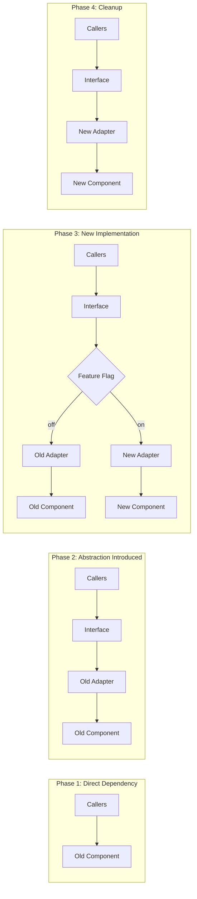
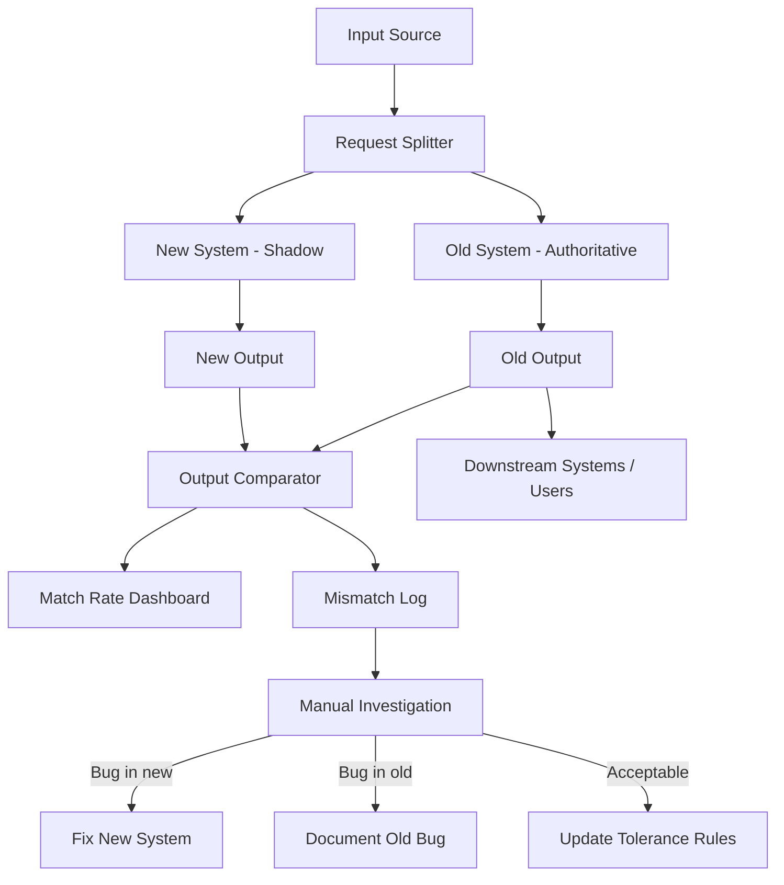
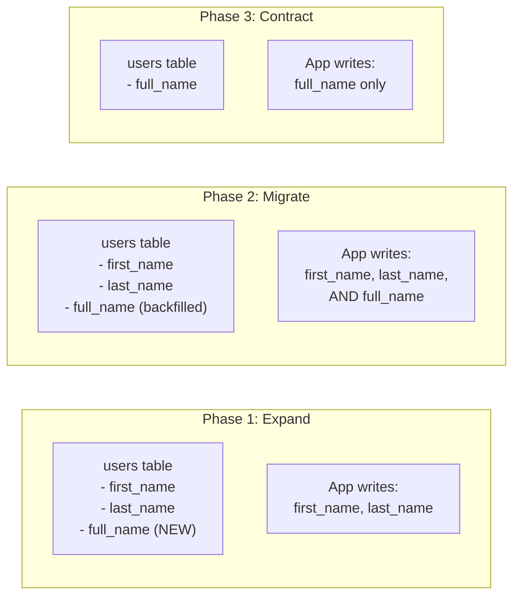

# Architecture Migration Playbooks

## Migration Principles

These principles apply to every migration strategy in this playbook. Violating them is the most common cause of migration failure.

1. **Never big-bang.** No matter how tempting it is to "just rewrite everything," incremental migration succeeds and big-bang migration fails. The history of software is littered with two-year rewrite projects that never shipped. Every migration must be decomposed into steps that each deliver working software.

2. **Every step must be reversible.** Before executing any migration step, define the rollback procedure and test it. If you cannot roll back, you cannot safely roll forward. The only exception is data migration steps that are inherently one-way -- and even those need a compensating action plan.

3. **Run old and new in parallel.** The old system is your safety net. Do not decommission it until the new system has proven itself under real load for a defined bake period (typically 1-4 weeks depending on risk tolerance).

4. **Measure before, during, and after.** Establish baseline metrics before migration begins: latency percentiles (P50, P95, P99), error rates, throughput, data correctness checksums. Monitor the same metrics throughout migration. Define quantitative success criteria and rollback triggers before starting.

5. **Feature flags are your best friend.** Every migration step should be gated behind a feature flag or configuration toggle. This gives you instant rollback capability (flip the flag) without requiring a deployment.

6. **Data migration is always the hardest part.** Code can be deployed and rolled back in minutes. Data changes are sticky. Schema migrations, data transformations, and state synchronization between old and new systems require the most planning, testing, and care.

7. **Communicate relentlessly.** Every stakeholder (engineering, product, operations, support) needs to know what is changing, when, and what to watch for. Migration failures are often detected first by customer support or users -- make sure they know what to report.

8. **Go through intermediate states.** Do not jump from monolith to microservices. Go monolith to modular monolith to microservices. Do not jump from on-premise to cloud-native. Go on-premise to lift-and-shift to cloud-optimized. Each intermediate state is a valid resting point.

---

## Strategy 1: Strangler Fig Pattern

**Named after:** Strangler fig trees that grow around a host tree, eventually replacing it entirely while the host tree decomposes from within.

**When to use:** Incrementally replacing a monolith or legacy system with a new system, especially when:
- The legacy system is too large or risky to replace all at once
- You need to keep the system running while replacing it
- Different parts of the system can be extracted independently
- You have a way to intercept and route requests (HTTP, message queue, etc.)

**How it works:**
1. Identify a module, feature, or bounded context to extract
2. Build the new implementation alongside the old
3. Route traffic to the new implementation via a proxy or gateway
4. When confident, remove the old code path
5. Repeat for the next module

### Detailed Steps

**Step 1: Set up the routing layer.**
Before extracting anything, you need a way to selectively route requests between old and new implementations. Options:
- **API Gateway** (Kong, AWS API Gateway, Envoy): Best for HTTP/REST systems. Route by path prefix, header, or query parameter.
- **Reverse proxy** (nginx, HAProxy): Simpler alternative. Route by URL pattern.
- **Application-level facade**: When you cannot add infrastructure, add a routing layer inside the application itself.

If the legacy system does not sit behind a gateway, add one now. Route 100% of traffic through it to the existing system. This is a zero-behavior-change step that establishes the routing capability.

**Step 2: Choose the first extraction target.**
Selection criteria for the first module:
- **Low risk**: Not the payment system. Not the auth system. Something where a bug is annoying, not catastrophic.
- **High value**: Demonstrates progress to stakeholders. Ideally something the team has been wanting to improve.
- **Well-bounded**: Minimal dependencies on other parts of the system. Clear input/output interface.
- **Observable**: Easy to measure correctness (deterministic outputs, comparable responses).

Common good first targets: a read-only reporting feature, a search endpoint, a notification service, a static content API.

**Step 3: Build the new service with the same API contract.**
The new implementation must expose the exact same API as the old one (same endpoints, same request/response schemas, same error codes). Internal implementation can be completely different, but the external contract must match. Write contract tests that run against both implementations.

**Step 4: Shadow traffic.**
Send every request to both old and new implementations. The old system remains authoritative (its response goes to the user). The new system's response is captured and compared. Log discrepancies. This phase reveals bugs in the new implementation without any user impact.

Duration: 1-2 weeks minimum, longer for high-risk features.

**Step 5: Canary rollout.**
Gradually shift real traffic to the new implementation:
- 1% for 24 hours -- monitor error rates and latency
- 10% for 48 hours -- monitor at scale
- 50% for 1 week -- confirm no edge cases
- 100% -- full cutover

Use the routing layer to control percentages. Monitor continuously. Roll back immediately if rollback criteria are met.

**Step 6: Remove old code path.**
After running at 100% for a 2-week bake period with no issues:
- Remove the old code
- Remove the routing logic (point directly to new service)
- Update documentation
- Celebrate (small wins matter in long migrations)

### Rollback Criteria

Trigger an immediate rollback to the old system if any of these occur:
- Error rate exceeds 2x the baseline measured before migration
- P95 latency exceeds 3x the baseline
- Data inconsistency detected between old and new system outputs
- Any data loss or corruption
- Cascading failures in downstream systems

### Mermaid Diagram -- Strangler Fig Progression

```mermaid
graph TB
    subgraph "Phase 1: Routing Layer"
        U1[Users] --> GW1[API Gateway]
        GW1 -->|100%| OLD1[Legacy Monolith]
    end

    subgraph "Phase 2: Shadow Traffic"
        U2[Users] --> GW2[API Gateway]
        GW2 -->|100% authoritative| OLD2[Legacy Monolith]
        GW2 -.->|shadow copy| NEW2[New Service A]
        NEW2 -.->|compare| DIFF[Response Comparator]
        OLD2 -.->|compare| DIFF
    end

    subgraph "Phase 3: Canary Rollout"
        U3[Users] --> GW3[API Gateway]
        GW3 -->|90%| OLD3[Legacy Monolith]
        GW3 -->|10%| NEW3[New Service A]
    end

    subgraph "Phase 4: Complete"
        U4[Users] --> GW4[API Gateway]
        GW4 -->|remaining paths| OLD4["Legacy Monolith\n(feature removed)"]
        GW4 -->|extracted path| NEW4[New Service A]
    end
```



---

## Strategy 2: Branch by Abstraction

**When to use:** Replacing an internal component, library, or subsystem where you cannot use a routing layer because the component is called internally (not via network). Common scenarios:
- Replacing an ORM or database driver
- Swapping a logging framework
- Replacing a homegrown component with a third-party library
- Migrating from one internal API to another

**How it works:**
1. Create an abstraction (interface/port) that captures the current behavior
2. Refactor all callers to use the abstraction instead of the concrete implementation
3. Build a new implementation of the abstraction
4. Toggle between old and new implementations via feature flag
5. Remove old implementation after bake period

### Detailed Steps

**Step 1: Define the interface.**
Analyze the current component's public API surface. Define an interface (or abstract class, or protocol, depending on language) that captures every method, function, or endpoint that callers use. Do not add new capabilities at this stage -- capture exactly what exists.

```
// Example: abstracting a notification sender
interface NotificationSender {
  send(recipient: string, message: string, channel: Channel): Promise<Result>
  getStatus(notificationId: string): Promise<Status>
  cancel(notificationId: string): Promise<void>
}
```

**Step 2: Write an adapter for the existing implementation.**
Wrap the current implementation in a class that implements the new interface. This should be a mechanical refactoring with no behavior change.

**Step 3: Update all callers.**
Replace every direct reference to the old implementation with a reference to the interface. This is often the most time-consuming step, especially in large codebases with widespread usage. Do it incrementally -- file by file, module by module. Each individual change should be small and safe.

**Step 4: Write the new implementation.**
Build the new adapter that implements the same interface using the new technology or approach. Write thorough tests against the interface contract.

**Step 5: Feature flag toggle.**
Use dependency injection or a factory pattern to select the implementation at runtime based on a feature flag:

```
function createNotificationSender(config: Config): NotificationSender {
  if (config.featureFlags.useNewNotificationSystem) {
    return new NewNotificationSender(config)
  }
  return new LegacyNotificationAdapter(config)
}
```

**Step 6: Test, canary, bake, remove.**
Same pattern as the Strangler Fig: shadow run, canary, full rollout, bake period, remove old implementation.

### Rollback Criteria

Revert the feature flag to the old implementation. Since both implementations exist behind the same interface, rollback is instantaneous and requires no deployment.

### Mermaid Diagram -- Branch by Abstraction Phases



---

## Strategy 3: Parallel Run

**When to use:** When correctness is more important than speed. Ideal for:
- Financial calculations (billing, invoicing, reconciliation)
- Data pipelines where output accuracy is critical
- Regulatory systems where errors have legal consequences
- Any system where "close enough" is not acceptable

**How it works:**
1. Run both old and new systems simultaneously on the same inputs
2. The old system remains authoritative (its output is used)
3. The new system's output is captured and compared
4. Discrepancies are investigated and fixed
5. When the match rate reaches the target threshold, the new system becomes authoritative
6. The old system continues in shadow mode as a safety net

### Detailed Steps

**Step 1: Build comparison infrastructure.**
Before starting the parallel run, you need:
- **Input capture**: A way to duplicate inputs to both systems (message queue fan-out, database triggers, request duplication middleware)
- **Output capture**: A way to store outputs from both systems with correlation IDs
- **Diff engine**: Automated comparison of outputs, with configurable tolerances (e.g., floating-point rounding, timestamp differences, field ordering)
- **Dashboard**: Real-time visibility into match rate, mismatch categories, and trends

**Step 2: Run in shadow mode.**
Route all real inputs to both systems. The old system's output goes to users/downstream systems. The new system's output is compared but discarded. Log every mismatch with full context (input, old output, new output, diff).

**Step 3: Categorize mismatches.**
For every mismatch, determine the root cause:
- **New system bug**: Fix in the new system
- **Old system bug**: The new system is actually correct (document and decide whether to fix the old system too)
- **Acceptable difference**: Different but equally valid (e.g., different ID generation, different sort order for equal elements). Add to the diff engine's tolerance rules.
- **Timing difference**: Results differ because of timing (e.g., cached vs. fresh data). May need architectural changes.

**Step 4: Iterate until match rate hits target.**
- **Financial systems**: Target 99.99%+ match rate. Every mismatch must be explainable.
- **General data pipelines**: Target 99.9%+ match rate.
- **Search/recommendation systems**: Target 95%+ relevance match (exact match is not expected).

Track match rate daily. It should trend upward. If it plateaus, investigate the remaining mismatch categories systematically.

**Step 5: Promote new system.**
When the match rate hits the target:
- Switch the new system to authoritative
- Keep the old system running in shadow mode (now comparing old output against new)
- Monitor for 2-4 weeks
- Decommission the old system

### Mermaid Diagram -- Parallel Run Architecture



---

## Strategy 4: Database Migration Strategies

Database migration is called out as its own strategy section because it is the hardest part of any migration, and it crosscuts all other strategies. You will use these patterns within Strangler Fig, Branch by Abstraction, or any other migration approach.

### Expand-Contract Pattern (Schema Changes)

Use for evolving a database schema without downtime. Also called "parallel change" or "expand and migrate."

**Phase 1 -- Expand:**
Add new columns, tables, or indexes alongside the existing ones. Do not remove or rename anything. The old code continues to work unchanged.

```sql
-- Expand: add new column alongside old
ALTER TABLE users ADD COLUMN full_name VARCHAR(255);
```

**Phase 2 -- Migrate:**
Backfill the new structures from old data. Update the write path to write to both old and new structures. This is the dual-write phase.

```sql
-- Backfill
UPDATE users SET full_name = first_name || ' ' || last_name
WHERE full_name IS NULL;
```

Update application code to write to both `full_name` and `first_name`/`last_name` on every write operation.

**Phase 3 -- Verify:**
Confirm that the new structures contain correct data. Run checksums, row counts, and spot checks. Verify that the application works correctly reading from the new structures.

**Phase 4 -- Contract:**
Update the read path to use the new structures. Remove the old columns/tables. Remove dual-write logic.

```sql
-- Contract: remove old columns (after verification period)
ALTER TABLE users DROP COLUMN first_name;
ALTER TABLE users DROP COLUMN last_name;
```

**Critical rule:** Each phase is a separate deployment. Never combine expand and contract in the same deployment. If something goes wrong during contract, you want the expand phase already safely in production to fall back to.

### Shared Database to Separate Databases (Service Extraction)

When extracting a service from a monolith, the database is the hardest coupling to break.

**Step 1:** Create a read replica of the shared database for the service being extracted. The new service reads from the replica. No change to writes.

**Step 2:** Build the new service's own database schema. Set up a synchronization mechanism from the shared database to the new service's database using CDC (Change Data Capture) or periodic batch sync.

**Step 3:** Migrate the new service's reads from the shared database replica to its own database. Verify data consistency.

**Step 4:** Introduce an API for writes. Instead of writing directly to the shared database, other services call the new service's API for writes to its domain data. The new service writes to its own database.

**Step 5:** Set up reverse sync from the new service's database back to the shared database (for other services that still read from it). This is temporary.

**Step 6:** Migrate remaining readers of this domain data from the shared database to the new service's API. Remove reverse sync. Remove the data from the shared database.

### CDC (Change Data Capture) for Live Data Sync

CDC captures row-level changes from a database and streams them to consumers. It enables real-time data synchronization without modifying application code.

**Tools:** Debezium (Kafka Connect-based, supports PostgreSQL, MySQL, MongoDB, SQL Server), DynamoDB Streams (built-in for DynamoDB), PostgreSQL logical replication, Maxwell (MySQL).

**Pattern:**
```
Old System writes to Old DB
  --> CDC captures changes (INSERT/UPDATE/DELETE)
  --> Changes streamed to message broker (Kafka)
  --> Consumer writes changes to New DB
  --> New System reads from New DB
```

**Key considerations:**
- CDC captures the change, not the intent. You get "row X changed to value Y," not "customer updated their email." If you need intent, use the outbox pattern instead.
- Ordering matters. Process changes in order per entity (partition by primary key).
- Handle deletes carefully. Soft deletes are easier to synchronize than hard deletes.
- Initial load. CDC captures ongoing changes. You still need a one-time bulk load of existing data.

### Mermaid Diagram -- Expand-Contract Pattern



---

## 5 Common Migration Paths

### Path 1: Monolith to Modular Monolith

**Risk level:** Low. Same deployment unit, same database, same infrastructure.

**Why do this:** Enforce boundaries and enable future extraction without taking on the operational complexity of distributed systems.

**Steps:**
1. **Identify modules.** Map the codebase to bounded contexts or domain areas. Use dependency analysis to find natural clusters.
2. **Enforce boundaries.** Each module gets its own directory/package. Modules communicate only through defined interfaces (public APIs), never through direct access to each other's internals.
3. **Extract shared code.** Move truly shared utilities into a shared/common module. Be strict -- shared code should be infrastructure-level (logging, HTTP utilities), not domain logic.
4. **Add interface contracts.** Define explicit interfaces between modules. Use compile-time checks (package visibility, module boundaries) to enforce them.
5. **Separate database schemas.** Each module owns its tables. Cross-module queries go through the owning module's API, not direct SQL joins.

**Timeline:** 3-6 months for a medium codebase (50K-200K lines of code).

**Success metric:** Zero cross-module direct imports. Every inter-module dependency goes through a defined interface. Verified by a linting rule or architecture test (e.g., ArchUnit, dependency-cruiser).

### Path 2: Monolith to Microservices (via Modular Monolith)

**Risk level:** High. Do not attempt without going through the modular monolith stage first.

**Why the intermediate step matters:** If you cannot draw clean boundaries within a single deployment, you will not magically draw them across network boundaries. Extracting coupled code into separate services creates a distributed monolith, which is strictly worse than a regular monolith (same coupling, plus network unreliability, plus operational complexity).

**Steps:**
1. Complete Path 1 (monolith to modular monolith).
2. Choose a module to extract as a service. Apply the same selection criteria as Strangler Fig Step 2 (low risk, high value, well-bounded).
3. Set up inter-service communication (REST, gRPC, or async messaging).
4. Extract the module into its own deployable unit using the Strangler Fig pattern.
5. Migrate the module's database tables to a separate database using the database migration strategies above.
6. Repeat for the next module.

**Timeline:** 6-18 months total (including the modular monolith phase).

**Success metric:** Each extracted service can be deployed independently. Deploying Service A does not require redeploying Service B.

### Path 3: Microservices to Modular Monolith (Consolidation)

**Risk level:** Medium. Operationally simpler target state, but merging services requires careful data consolidation.

**Why do this:** The industry has learned that microservices have significant operational costs (distributed tracing, network reliability, deployment coordination, data consistency). Many teams that adopted microservices prematurely are consolidating back to modular monoliths while preserving the domain boundaries they established.

**Steps:**
1. Identify services to merge. Start with services that are always deployed together, have synchronous call chains, or share developers.
2. Create a shared deployment unit (monolith with module structure).
3. Move service code into modules within the monolith, preserving interfaces.
4. Replace network calls between merged services with in-process calls through the module interfaces.
5. Consolidate databases using the expand-contract pattern.
6. Decommission the old service infrastructure.

**Timeline:** 3-12 months depending on the number of services being consolidated.

**Success metric:** Reduced operational complexity (fewer deployments, fewer network hops, simpler debugging) while maintaining domain boundaries within the codebase.

### Path 4: On-Premise to Cloud

**Risk level:** Medium to high, depending on the system's statefulness and external dependencies.

**Steps:**
1. **Inventory.** Catalog every application, database, service, and dependency. Identify external integrations that assume on-premise networking (VPN, firewall rules, IP whitelists).
2. **Dependency mapping.** Build a dependency graph. Identify groups of components that must migrate together (migration wave planning).
3. **Lift-and-shift first.** Move applications to cloud VMs (EC2, Compute Engine) with minimal changes. This is not the end state -- it is the safe first step. Resist the temptation to re-architect during the initial move.
4. **Validate.** Confirm everything works in the cloud with the same performance and correctness characteristics. Run parallel for critical systems.
5. **Optimize incrementally.** Replace self-managed components with cloud-native services one at a time: self-managed PostgreSQL becomes RDS/Cloud SQL, self-managed Redis becomes ElastiCache/Memorystore, self-managed Kafka becomes MSK/Pub-Sub.
6. **Decommission on-premise.** After all applications are migrated and validated, decommission on-premise infrastructure.

**Timeline:** 6-24 months depending on system size and complexity.

**Key risk:** Network latency between components that migrated and components that have not yet migrated. Plan migration waves to minimize cross-boundary latency.

### Path 5: Synchronous to Event-Driven

**Risk level:** Medium. Changes the fundamental communication model.

**Steps:**
1. **Identify command/event boundaries.** For each synchronous call, ask: "Does the caller need an immediate response?" If no, it is a candidate for async. If yes, it stays synchronous.
2. **Introduce a message broker.** Kafka, RabbitMQ, AWS SQS/SNS, Google Pub/Sub, or NATS. Choose based on your durability, ordering, and throughput requirements.
3. **Convert one flow at a time.** Start with fire-and-forget operations (send email, write audit log, update search index). These are the safest to convert because the caller does not need the result.
4. **Implement the outbox pattern** for reliability. Instead of publishing directly to the message broker (which can fail independently of the database transaction), write events to an outbox table within the same database transaction. A separate process reads the outbox and publishes to the broker.
5. **Add idempotency.** Consumers must handle duplicate messages gracefully. Use idempotency keys or deduplication at the consumer level.
6. **Convert request-reply patterns** last. These are the hardest because the caller expects a response. Use correlation IDs and reply queues, or keep these synchronous.

**Timeline:** 3-9 months.

**Success metric:** Reduced synchronous call chain depth. No synchronous chain longer than 3 hops. Improved resilience (failure of a downstream consumer does not block the producer).

---

## Migration Anti-Patterns

These are the most common ways migrations fail. Recognizing these patterns early can save months of wasted effort.

**Big Bang.** Attempting to migrate the entire system in one step. Symptoms: a "migration weekend" with a go/no-go decision, no intermediate working states, everyone holds their breath during cutover. Why it fails: too many variables changing simultaneously, impossible to isolate the cause of failures, no partial rollback possible.

**Distributed Monolith.** Extracting services from a monolith without fixing the underlying coupling. Symptoms: deploying Service A requires simultaneously deploying Services B and C, services call each other synchronously in long chains, shared database with cross-service joins. Why it fails: you have all the complexity of microservices with none of the benefits.

**Data Bypass.** Services accessing each other's databases directly instead of going through APIs. Symptoms: Service A reads from Service B's tables, schema changes in Service B break Service A. Why it fails: creates invisible coupling that defeats the purpose of service boundaries.

**Missing Rollback.** Proceeding with migration steps that have no defined rollback procedure. Symptoms: "we'll figure it out if something goes wrong," untested rollback scripts, no rollback criteria defined. Why it fails: when something goes wrong (and it will), panic-driven rollback attempts cause more damage than the original problem.

**Ignoring Data.** Focusing entirely on code migration while treating data migration as an afterthought. Symptoms: code is ready to deploy but data migration has not been tested, no plan for data consistency during transition, no backfill strategy for historical data. Why it fails: data migration is the hardest and most time-consuming part. Discovering this late derails timelines.

**Premature Optimization.** Over-engineering the target architecture before validating that the basic migration works. Symptoms: building an event-sourcing system before confirming the new service can handle simple CRUD, adding caching layers before measuring baseline performance. Why it fails: adds complexity and delays the feedback loop. Get the basics working first, then optimize.

---

## Migration Checklist Template

Use this checklist for every migration initiative. Copy it into your project tracking system and check off items as you complete them.

```markdown
## Migration: [Name]

### Planning
- [ ] Current state documented (C4 context + container diagrams)
- [ ] Target state defined (C4 diagrams of desired end state)
- [ ] Migration strategy selected (Strangler Fig / Branch by Abstraction / Parallel Run)
- [ ] Success criteria defined and measurable
- [ ] Rollback plan documented and tested
- [ ] Timeline estimated with milestones

### Preparation
- [ ] Feature flags in place for toggling between old and new
- [ ] Monitoring configured for baseline metrics (latency, errors, throughput)
- [ ] Alerting configured for rollback criteria thresholds
- [ ] Data migration strategy defined (expand-contract / CDC / batch sync)
- [ ] Data migration tested with production-scale dataset
- [ ] Communication plan shared with team and stakeholders

### Execution
- [ ] Phase 1 scope identified (smallest useful increment)
- [ ] Shadow/parallel run executing and discrepancies < threshold
- [ ] Canary rollout started (1% traffic)
- [ ] Canary expanded (10% traffic)
- [ ] Canary expanded (50% traffic)
- [ ] Full rollout (100% traffic)
- [ ] Bake period started (2-week minimum)

### Completion
- [ ] Bake period completed with no rollback-triggering events
- [ ] Old code/infrastructure decommissioned
- [ ] Documentation updated (architecture diagrams, runbooks, ADRs)
- [ ] Retrospective conducted (what worked, what to improve for next phase)
- [ ] Monitoring updated to reflect new baseline
```

---

## Choosing the Right Strategy

| Scenario | Recommended Strategy | Rollback Speed |
|----------|---------------------|----------------|
| Replacing external-facing features | Strangler Fig | Seconds (routing) |
| Replacing internal libraries/components | Branch by Abstraction | Seconds (feature flag) |
| Financial or correctness-critical systems | Parallel Run | Minutes (promote/demote) |
| Database schema evolution | Expand-Contract | Minutes (revert read path) |
| Service database extraction | CDC + Strangler Fig | Hours (complex) |

**When in doubt, combine strategies.** A typical monolith-to-microservices migration uses Strangler Fig for routing, Branch by Abstraction for internal components, Parallel Run for critical data paths, and Expand-Contract for schema changes. They are complementary, not mutually exclusive.
