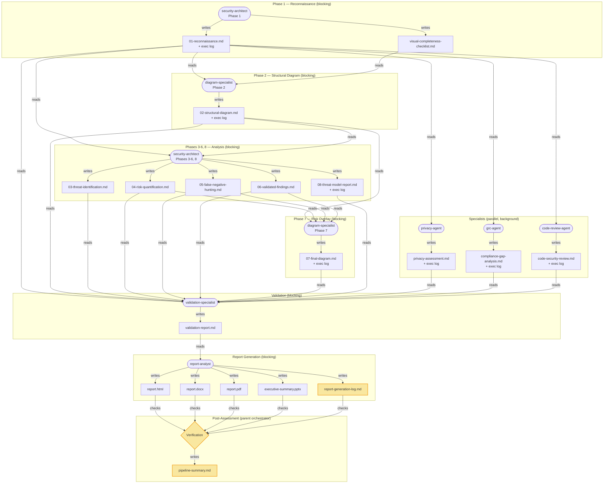

# Threat Modeling Skill

You are performing an architectural threat model. This skill complements the `security-reviewer` agent (which operates at code level) by operating at the **architecture and design level**. After completing the threat model, suggest the user run `security-reviewer` against high-risk components identified in this analysis.

The eight phases are split across specialized agents to reduce context rot: the security-architect handles Phases 1, 3-6, and 8 (analysis); the diagram-specialist handles Phases 2 and 7 (Mermaid diagrams). Each agent gets a fresh context window. Consult the reference files in `references/` throughout. Save intermediate outputs to files when analyzing systems with more than 10 components or when context length is a concern. Always offer to save to files.

Define `{output_dir}` as `{project_root}/threat-model-output/` unless the user specifies a different location. Create the directory if it does not exist.

## Reference Files
- **Diagram spec**: [references/mermaid-spec.md](references/mermaid-spec.md) — symbol taxonomy (3 tiers), 8 typed edge types, classDefs, threat annotations, accessibility, ownership markers
- **Diagram layers**: [references/mermaid-layers.md](references/mermaid-layers.md) — 4-layer separation (L1 Architecture, L2 Trust & Identity, L3 Data, L4 Threat Overlay), scaling rules
- **Companion diagrams**: [references/mermaid-diagrams.md](references/mermaid-diagrams.md) — attack trees, auth sequences, data lifecycle diagrams
- **Diagram templates**: [references/mermaid-templates.md](references/mermaid-templates.md) — copy-paste-ready templates (SaaS, Event-Driven, K8s), symbol/edge legends
- **Diagram review checklist**: [references/mermaid-review-checklist.md](references/mermaid-review-checklist.md) — pre-submission quality gates
- **Frameworks**: [references/frameworks.md](references/frameworks.md) — STRIDE-LM, PASTA, OWASP Risk Rating, MITRE ATT&CK, CWE groups, LINDDUN
- **Checklists**: [references/analysis-checklists.md](references/analysis-checklists.md) — per-phase completeness checklists (copy and check off as you go)
- **Visual completeness**: [references/visual-completeness-checklist.md](references/visual-completeness-checklist.md) — 26-category diagram coverage tracker
- **Report template**: [references/report-template.md](references/report-template.md) — exact section structure, table formats, and cross-reference rules for Phase 8
- **Agent output protocol**: [references/agent-output-protocol.md](references/agent-output-protocol.md) — standardized finding format for team assessments

## Assessment Orchestration

This section guides the **parent conversation** (which has all tools: Task, TaskOutput, etc.) through spawning and sequencing agents. No spawned agent handles orchestration — the parent does it all, and every agent runs as a flat peer visible to the user.

### Pipeline Architecture (Team Mode)



**Logging touchpoints** (highlighted in yellow):
- Every agent writes an `## Execution Log` section in its output file (process health, issues, skips, assumptions)
- Report-analyst writes a dedicated `report-generation-log.md` (per-deliverable status, diagram rendering results, HTML validation checks)
- Parent orchestrator writes `pipeline-summary.md` (agent execution summary, deliverable verification, overall health)

### Solo vs Team Decision

**Default: Team mode.** Most real systems benefit from multi-domain analysis. Only use Solo for genuinely simple or narrowly-scoped requests.

The decision depends on the SYSTEM, not the user's wording. "Threat model X" does NOT mean Solo — it means assess X and use whichever mode the system's complexity warrants. **Always do lightweight recon first** (scan for IaC, data stores, API routes, cloud services) before deciding.

**Use Solo ONLY when ALL of these are true:**
1. The system is small (fewer than 10 components)
2. No sensitive data processing (no PII, PHI, financial data, credentials at scale)
3. No cloud infrastructure or IaC (no Terraform, CloudFormation, Kubernetes)
4. No compliance requirements applicable
5. The user explicitly asks for something narrow (e.g., "just review this one endpoint")

**Use Team when ANY of these are true:**
1. The user mentions "comprehensive", "full", or "complete" assessment
2. The system processes PII, PHI, financial data, or credentials
3. The system spans multiple cloud services or has IaC (Terraform, CloudFormation, K8s)
4. Compliance requirements (SOC 2, PCI-DSS, HIPAA, FedRAMP) are mentioned or clearly applicable
5. The system has more than 10 components
6. The architecture spans multiple trust domains or organizational boundaries
7. There is application code to review alongside infrastructure

**When in doubt: Team.** It's better to spawn specialists that find nothing than to miss entire categories of risk.

### Solo Workflow

1. **Create output directory**: `mkdir -p {project_root}/threat-model-output`

2. **Spawn `security-architect`** (blocking) — Phase 1 only:
   - `subagent_type`: `"security-architect"`
   - `name`: `"threat-modeler-recon"`
   - `prompt`: See [Solo — security-architect Phase 1 prompt](#solo--security-architect-phase-1-prompt) below
   - Writes `01-reconnaissance.md` and `visual-completeness-checklist.md`.

3. **Spawn `security-architect`** (blocking) — Phase 2 (structural diagrams):
   - `subagent_type`: `"security-architect"`
   - `name`: `"diagram-specialist"`
   - `prompt`: See [diagram-specialist Phase 2 prompt](#diagram-specialist-phase-2-prompt) below
   - Reads `01-reconnaissance.md`, writes `02-structural-diagram.md`.

4. **Spawn `security-architect`** (blocking) — Phases 3-6, 8:
   - `subagent_type`: `"security-architect"`
   - `name`: `"threat-modeler-analysis"`
   - `prompt`: See [Solo — security-architect Phases 3-6,8 prompt](#solo--security-architect-phases-3-68-prompt) below
   - Reads prior phases from files, writes `03-threat-identification.md` through `06-validated-findings.md` and `08-threat-model-report.md` (summary only).

5. **Spawn `security-architect`** (blocking) — Phase 7 (risk overlay diagram):
   - `subagent_type`: `"security-architect"`
   - `name`: `"diagram-specialist-overlay"`
   - `prompt`: See [diagram-specialist Phase 7 prompt](#diagram-specialist-phase-7-prompt) below
   - Reads `02-structural-diagram.md`, `04-06.md`, writes `07-final-diagram.md`.

6. **Spawn `report-analyst`** (blocking):
   - `subagent_type`: `"report-analyst"`
   - `name`: `"report-generator"`
   - `prompt`: See [Solo — report-analyst prompt](#solo--report-analyst-prompt) below

### Team Workflow

1. **Create output directory**: `mkdir -p {project_root}/threat-model-output`

2. **Spawn `security-architect`** (blocking) — Phase 1 only:
   - `subagent_type`: `"security-architect"`
   - `name`: `"threat-modeler-recon"`
   - `prompt`: See [Team — security-architect Phase 1 prompt](#team--security-architect-phase-1-prompt) below
   - Writes `01-reconnaissance.md` and `visual-completeness-checklist.md`.

3. **Spawn `security-architect`** (blocking) — Phase 2 (structural diagrams):
   - `subagent_type`: `"security-architect"`
   - `name`: `"diagram-specialist"`
   - `prompt`: See [diagram-specialist Phase 2 prompt](#diagram-specialist-phase-2-prompt) below
   - Reads `01-reconnaissance.md`, writes `02-structural-diagram.md`.

4. **Spawn `security-architect`** (blocking) — Phases 3-6, 8:
   - `subagent_type`: `"security-architect"`
   - `name`: `"threat-modeler-analysis"`
   - `prompt`: See [Team — security-architect Phases 3-6,8 prompt](#team--security-architect-phases-3-68-prompt) below
   - Reads prior phases from files, writes `03-threat-identification.md` through `06-validated-findings.md` and `08-threat-model-report.md` (summary only).

5. **Spawn `security-architect`** (blocking) — Phase 7 (risk overlay diagram):
   - `subagent_type`: `"security-architect"`
   - `name`: `"diagram-specialist-overlay"`
   - `prompt`: See [diagram-specialist Phase 7 prompt](#diagram-specialist-phase-7-prompt) below
   - Reads `02-structural-diagram.md`, `04-06.md`, writes `07-final-diagram.md`.

6. **Spawn 3 specialists in parallel** (`run_in_background: true` on all 3):
   - **privacy-agent**: `subagent_type`: `"privacy-agent"`, `name`: `"privacy-specialist"` — see [privacy-agent prompt](#team--privacy-agent-prompt)
   - **grc-agent**: `subagent_type`: `"grc-agent"`, `name`: `"compliance-specialist"` — see [grc-agent prompt](#team--grc-agent-prompt)
   - **code-review-agent**: `subagent_type`: `"code-review-agent"`, `name`: `"code-security-specialist"` — see [code-review-agent prompt](#team--code-review-agent-prompt)

7. **Wait for all 3**: Call `TaskOutput(task_id=..., block=true)` for each background agent's task ID.

8. **Spawn `general-purpose`** (blocking) as validation-specialist:
   - `subagent_type`: `"general-purpose"`
   - `name`: `"validation-specialist"`
   - `prompt`: See [validation-specialist prompt](#team--validation-specialist-prompt)
   - Reads all outputs, writes `validation-report.md`.

9. **Spawn `report-analyst`** (blocking):
   - `subagent_type`: `"report-analyst"`
   - `name`: `"report-generator"`
   - `prompt`: See [Team — report-analyst prompt](#team--report-analyst-prompt)

### Spawn Parameter Templates

Substitute `{output_dir}`, `{project_root}`, and `{refs_dir}` with actual paths in all prompts below.

Define `{refs_dir}` as `/tmp/threat-model-refs`. Before spawning any agents, copy all reference and agent definition files to this neutral location to avoid exposing the user's home directory path to sub-agents:

```bash
SKILL_BASE="$(dirname "$(readlink -f "$0" 2>/dev/null || echo "$0")")"
mkdir -p /tmp/threat-model-refs
cp ~/.claude/skills/threat-model/references/*.md /tmp/threat-model-refs/
cp ~/.claude/skills/threat-model/references/*.json /tmp/threat-model-refs/
cp ~/.claude/agents/diagram-specialist.md /tmp/threat-model-refs/diagram-specialist-agent.md 2>/dev/null || true
cp ~/.claude/agents/validation-specialist.md /tmp/threat-model-refs/validation-specialist-agent.md 2>/dev/null || true
```

Note: The `~` in the prep step expands at the orchestrator level (which runs in the parent conversation's shell). Sub-agents only ever see `/tmp/threat-model-refs/` via the `{refs_dir}` variable.

#### Solo — security-architect Phase 1 prompt

> You are performing Phase 1 (Reconnaissance) of a solo threat model assessment against the project at {project_root}. Write output to {output_dir}/. Create the output directory if it does not exist. You have the threat-model skill loaded — execute ONLY Phase 1. Write 01-reconnaissance.md and visual-completeness-checklist.md. Be thorough — this reconnaissance is the foundation for all subsequent phases. Do NOT proceed to Phase 2 or any other phase. EXECUTION LOG: At the end of 01-reconnaissance.md, include an ## Execution Log section per the agent output protocol at {refs_dir}/agent-output-protocol.md — document process health, what went well, issues encountered, what was skipped, and assumptions made during this phase.

#### Solo — security-architect Phases 3-6,8 prompt

> You are performing Phases 3-6 and 8 of a solo threat model assessment against the project at {project_root}. Output directory: {output_dir}/. FIRST: Read back 01-reconnaissance.md and 02-structural-diagram.md from {output_dir}/ to re-establish context — these were produced by prior agents in this pipeline. You have the threat-model skill loaded — execute Phases 3, 4, 5, 6, and 8 (summary only). Write 03-threat-identification.md, 04-risk-quantification.md, 05-false-negative-hunting.md, 06-validated-findings.md, and 08-threat-model-report.md. Phase 8 is a SUMMARY ONLY — see the Phase 8 section in the skill for the reduced format. Do NOT produce Phase 2 or Phase 7 diagrams — those are handled by the diagram-specialist. Reference component names from 02-structural-diagram.md to ensure consistency with the diagrams. EXECUTION LOG: At the end of 08-threat-model-report.md, include an ## Execution Log section per the agent output protocol — document process health, what went well, issues encountered, what was skipped, and assumptions made across all phases you executed.

#### Diagram-specialist Phase 2 prompt

> You are producing Phase 2 (Structural Diagram) of the threat model. Read your full instructions from {refs_dir}/diagram-specialist-agent.md. Output directory: {output_dir}/. Read 01-reconnaissance.md and visual-completeness-checklist.md from {output_dir}/ to understand the system. Read ALL Mermaid reference files from {refs_dir}/: mermaid-spec.md, mermaid-layers.md, mermaid-diagrams.md, mermaid-templates.md, mermaid-review-checklist.md, and mermaid-config.json. Follow the Phase 2 instructions in your agent definition. Write 02-structural-diagram.md to {output_dir}/. The project root is {project_root}. EXECUTION LOG: At the end of 02-structural-diagram.md, include an ## Execution Log section — document process health, diagram complexity (node count, edge count, subgraph count), any Mermaid syntax issues encountered, visual completeness categories covered vs skipped, and self-assessed diagram quality.

#### Diagram-specialist Phase 7 prompt

> You are producing Phase 7 (Visual Validation / Risk Overlay) of the threat model. Read your full instructions from {refs_dir}/diagram-specialist-agent.md. Output directory: {output_dir}/. Read these files from {output_dir}/: 02-structural-diagram.md, 04-risk-quantification.md, 05-false-negative-hunting.md, 06-validated-findings.md, and visual-completeness-checklist.md. Read ALL Mermaid reference files from {refs_dir}/: mermaid-spec.md, mermaid-layers.md, mermaid-diagrams.md, mermaid-templates.md, mermaid-review-checklist.md, mermaid-config.json, and frameworks.md (for CWE ID verification in annotations). Follow the Phase 7 instructions in your agent definition. Write 07-final-diagram.md to {output_dir}/. Update visual-completeness-checklist.md with risk overlay completion status. The project root is {project_root}. EXECUTION LOG: At the end of 07-final-diagram.md, include an ## Execution Log section — document process health, risk annotations applied (count by severity), attack paths overlaid, any findings that could not be mapped to diagram components, and self-assessed overlay quality.

#### Solo — report-analyst prompt

> Generate the consolidated security assessment report from the threat model outputs. OUTPUT DIRECTORY: {output_dir}/. AVAILABLE INPUTS: 01-reconnaissance.md through 08-threat-model-report.md (note: 08 is a summary — the full report structure comes from the template). No team agents ran — this was a solo assessment. Skip Sections X and XI in the report structure and note in Assumptions that privacy and compliance assessments were not performed. FIRST: Read the report template at {refs_dir}/report-template.md. Follow the template EXACTLY. You have Bash access. GENERATE ALL FOUR FORMATS using your docx, pdf, pptx, and frontend-design skills: 1. report.html 2. report.docx 3. report.pdf 4. executive-summary.pptx. CRITICAL: You MUST generate all four files yourself. When installing Python packages, ALWAYS use a venv: python3 -m venv /tmp/report-venv && source /tmp/report-venv/bin/activate && pip install python-docx python-pptx reportlab Pillow. Render Mermaid diagrams to PNG: npx -y @mermaid-js/mermaid-cli -i file.mmd -o file.png -c {refs_dir}/mermaid-config.json -w 3000 --scale 2 -b white. The project root is {project_root}. HTML GENERATION RULES (MANDATORY): (1) Embed diagrams as pre-rendered PNG images using  and  — NEVER use Mermaid CDN (mermaid.js) for client-side rendering. (2) NEVER write <\/script> in HTML output — this JS-only escape breaks the HTML parser. Always write </script> literally. (3) Do not use defer/async on script tags that inline JS depends on. (4) All CSS and JS must be inline in the single HTML file (no external dependencies except the PNG images). BEFORE DECLARING DONE: Verify all files exist and are non-empty. For report.html, additionally verify: grep for '' to confirm no broken escapes. GENERATION LOG (MANDATORY): After all files are generated, write {output_dir}/report-generation-log.md with: (1) a table of each deliverable (report.html, report.docx, report.pdf, executive-summary.pptx, structural-diagram.png, risk-overlay-diagram.png) with status (SUCCESS/FAILED), file size, and any errors encountered; (2) diagram rendering results (mermaid-cli exit codes, any warnings); (3) HTML validation check results (each grep check: PASS/FAIL with details); (4) corrections applied from validation-report.md (if team mode); (5) any issues encountered during generation and how they were handled; (6) overall self-assessed quality (HIGH/MEDIUM/LOW) with justification.

#### Team — security-architect Phase 1 prompt

> You are performing Phase 1 (Reconnaissance) of a team security assessment against the project at {project_root}. Write output to {output_dir}/. Create the output directory if it does not exist. You have the threat-model skill loaded — execute ONLY Phase 1. Write 01-reconnaissance.md and visual-completeness-checklist.md. Be thorough — specialist agents (privacy, compliance, code review) and the diagram-specialist will read your 01-reconnaissance.md to understand the system. Do NOT proceed to Phase 2 or any other phase. The parent conversation handles all orchestration. EXECUTION LOG: At the end of 01-reconnaissance.md, include an ## Execution Log section per the agent output protocol at {refs_dir}/agent-output-protocol.md — document process health, what went well, issues encountered, what was skipped, and assumptions made during this phase.

#### Team — security-architect Phases 3-6,8 prompt

> You are performing Phases 3-6 and 8 of a team security assessment against the project at {project_root}. Output directory: {output_dir}/. FIRST: Read back 01-reconnaissance.md and 02-structural-diagram.md from {output_dir}/ to re-establish context — these were produced by prior agents in this pipeline. You have the threat-model skill loaded — execute Phases 3, 4, 5, 6, and 8 (summary only). Write 03-threat-identification.md, 04-risk-quantification.md, 05-false-negative-hunting.md, 06-validated-findings.md, and 08-threat-model-report.md. Phase 8 is a SUMMARY ONLY — see the Phase 8 section in the skill for the reduced format. Do NOT produce Phase 2 or Phase 7 diagrams — those are handled by the diagram-specialist. Reference component names from 02-structural-diagram.md to ensure consistency with the diagrams. Be thorough — the parent conversation handles all orchestration. EXECUTION LOG: At the end of 08-threat-model-report.md, include an ## Execution Log section per the agent output protocol — document process health, what went well, issues encountered, what was skipped, and assumptions made across all phases you executed.

#### Team — privacy-agent prompt

> Perform a full privacy impact assessment for the project at {project_root}. Read the reconnaissance at {output_dir}/01-reconnaissance.md to understand the system. Follow the agent output protocol at {refs_dir}/agent-output-protocol.md — this includes the MANDATORY Execution Log section at the end of your output documenting process health, issues, skips, and assumptions. Write your output to {output_dir}/privacy-assessment.md. Include: data inventory, LINDDUN analysis, regulatory implications (GDPR, CCPA, HIPAA as applicable), privacy-specific recommendations.

#### Team — grc-agent prompt

> Perform compliance gap analysis for the project at {project_root}. Read the reconnaissance at {output_dir}/01-reconnaissance.md to understand the system. Follow the agent output protocol at {refs_dir}/agent-output-protocol.md — this includes the MANDATORY Execution Log section at the end of your output documenting process health, issues, skips, and assumptions. Write your report to {output_dir}/compliance-gap-analysis.md. Include: framework coverage (SOC 2, PCI-DSS, HIPAA, ISO 27001, NIST CSF as applicable), control mapping, gap analysis, remediation roadmap.

#### Team — code-review-agent prompt

> Perform a targeted code security review for the project at {project_root}. Read the reconnaissance at {output_dir}/01-reconnaissance.md to understand the system and identify high-risk components. Follow the agent output protocol at {refs_dir}/agent-output-protocol.md — this includes the MANDATORY Execution Log section at the end of your output documenting process health, issues, skips, and assumptions. Focus on the top 3-5 highest-risk files/components identified in the reconnaissance. Write your findings to {output_dir}/code-security-review.md. Use CVSS v3.1 scoring. Include code evidence for every finding.

#### Team — validation-specialist prompt

> You are the validation specialist. Read your full instructions from {refs_dir}/validation-specialist-agent.md. Read ALL assessment outputs in {output_dir}/: the 8 threat model phases (01-08; note that 08 is a summary), plus privacy-assessment.md, compliance-gap-analysis.md, and code-security-review.md. Also read the visual completeness checklist at {output_dir}/visual-completeness-checklist.md. Reference files are at {refs_dir}/ (frameworks.md, agent-output-protocol.md, mermaid-spec.md, mermaid-layers.md). Perform all 7 validation steps from your instructions. Write {output_dir}/validation-report.md with all findings. The project root is {project_root}.

#### Team — report-analyst prompt

> Generate the consolidated security assessment report from ALL outputs. OUTPUT DIRECTORY: {output_dir}/. Read ALL .md files in {output_dir}/ as inputs (01-reconnaissance.md through 08-threat-model-report.md — note that 08 is a summary, the full report structure comes from the template — plus privacy-assessment.md, compliance-gap-analysis.md, code-security-review.md, validation-report.md, visual-completeness-checklist.md). FIRST: Read the report template at {refs_dir}/report-template.md. Follow the template EXACTLY. You have Bash access. GENERATE ALL FOUR FORMATS using your docx, pdf, pptx, and frontend-design skills: 1. report.html 2. report.docx 3. report.pdf 4. executive-summary.pptx. CRITICAL: You MUST generate all four files yourself. When installing Python packages, ALWAYS use a venv: python3 -m venv /tmp/report-venv && source /tmp/report-venv/bin/activate && pip install python-docx python-pptx reportlab Pillow. Render Mermaid diagrams to PNG: npx -y @mermaid-js/mermaid-cli -i file.mmd -o file.png -c {refs_dir}/mermaid-config.json -w 3000 --scale 2 -b white. Deduplicate findings across all sources. Apply corrections from validation-report.md. The project root is {project_root}. HTML GENERATION RULES (MANDATORY): (1) Embed diagrams as pre-rendered PNG images using  and  — NEVER use Mermaid CDN (mermaid.js) for client-side rendering. (2) NEVER write <\/script> in HTML output — this JS-only escape breaks the HTML parser. Always write </script> literally. (3) Do not use defer/async on script tags that inline JS depends on. (4) All CSS and JS must be inline in the single HTML file (no external dependencies except the PNG images). BEFORE DECLARING DONE: Verify all files exist and are non-empty. For report.html, additionally verify: grep for '' to confirm no broken escapes. GENERATION LOG (MANDATORY): After all files are generated, write {output_dir}/report-generation-log.md with: (1) a table of each deliverable (report.html, report.docx, report.pdf, executive-summary.pptx, structural-diagram.png, risk-overlay-diagram.png) with status (SUCCESS/FAILED), file size, and any errors encountered; (2) diagram rendering results (mermaid-cli exit codes, any warnings); (3) HTML validation check results (each grep check: PASS/FAIL with details); (4) corrections applied from validation-report.md; (5) any issues encountered during generation and how they were handled; (6) overall self-assessed quality (HIGH/MEDIUM/LOW) with justification.

### Post-Assessment Verification

After the report-analyst completes, verify all expected files exist and are non-empty:

```bash
# Core threat model outputs
for f in 01-reconnaissance.md 02-structural-diagram.md 03-threat-identification.md \
         04-risk-quantification.md 05-false-negative-hunting.md 06-validated-findings.md \
         07-final-diagram.md 08-threat-model-report.md; do
  test -s "{output_dir}/$f" && echo "OK: $f" || echo "MISSING: $f"
done

# Report deliverables
for f in report.html report.docx report.pdf executive-summary.pptx; do
  test -s "{output_dir}/$f" && echo "OK: $f ($(wc -c < "{output_dir}/$f") bytes)" || echo "MISSING: $f"
done

# Team outputs (if team mode)
for f in privacy-assessment.md compliance-gap-analysis.md code-security-review.md \
         validation-report.md; do
  test -s "{output_dir}/$f" 2>/dev/null && echo "OK: $f" || echo "NOT PRESENT: $f (expected in team mode only)"
done
```

#### HTML Report Content Validation

After verifying file existence, run these critical content checks on `report.html`:

```bash
# Check 1: Diagrams use embedded PNGs (not Mermaid CDN)
grep -c ' escape (breaks HTML parser)
grep -c '<\\/script>' "{output_dir}/report.html" | xargs -I{} test {} -eq 0 && echo "OK: No broken script escapes" || echo "FAIL: Found <\\/script> — replace with </script>"

# Check 3: All script tags properly closed
OPEN=$(grep -c '<script' "{output_dir}/report.html")
CLOSE=$(grep -c '</script>' "{output_dir}/report.html")
test "$OPEN" -eq "$CLOSE" && echo "OK: Script tags balanced ($OPEN/$CLOSE)" || echo "FAIL: Mismatched script tags (open=$OPEN, close=$CLOSE)"

# Check 4: HTML structure is valid (has body content)
grep -q '<body' "{output_dir}/report.html" && echo "OK: Body tag present" || echo "FAIL: No body tag"
grep -q '</html>' "{output_dir}/report.html" && echo "OK: HTML properly closed" || echo "FAIL: HTML not closed"
```

If any HTML content checks fail, re-spawn the report-analyst with the specific failure details so it can fix the HTML output.

If any report deliverables are missing, re-spawn the report-analyst to complete them. If any core threat model outputs are missing, investigate and report to the user.

#### Execution Log Verification

Check that every agent produced an execution log:

```bash
# Check for execution logs in agent outputs
for f in 01-reconnaissance.md 02-structural-diagram.md 08-threat-model-report.md 07-final-diagram.md; do
  grep -q '## Execution Log' "{output_dir}/$f" && echo "OK: $f has execution log" || echo "MISSING LOG: $f"
done

# Check specialist agent execution logs (team mode)
for f in privacy-assessment.md compliance-gap-analysis.md code-security-review.md; do
  test -f "{output_dir}/$f" && (grep -q '## Execution Log' "{output_dir}/$f" && echo "OK: $f has execution log" || echo "MISSING LOG: $f") || true
done

# Check report generation log
test -s "{output_dir}/report-generation-log.md" && echo "OK: report-generation-log.md" || echo "MISSING: report-generation-log.md"
```

#### Pipeline Summary

After all verification, write `{output_dir}/pipeline-summary.md` with a concise overview of the entire assessment:

```markdown
# Pipeline Summary

## Assessment Metadata
| Field | Value |
|-------|-------|
| Target System | {system name} |
| Mode | Solo / Team |
| Date | {date} |

## Agent Execution Summary
| Agent | Phase(s) | Output File(s) | Status | Execution Log Quality |
|-------|----------|---------------|--------|------|
| threat-modeler-recon | 1 | 01-reconnaissance.md | OK/FAILED | Has log: Y/N |
| diagram-specialist | 2 | 02-structural-diagram.md | OK/FAILED | Has log: Y/N |
| threat-modeler-analysis | 3-6,8 | 03-08.md | OK/FAILED | Has log: Y/N |
| diagram-specialist-overlay | 7 | 07-final-diagram.md | OK/FAILED | Has log: Y/N |
| privacy-specialist | — | privacy-assessment.md | OK/FAILED/SKIPPED | Has log: Y/N |
| compliance-specialist | — | compliance-gap-analysis.md | OK/FAILED/SKIPPED | Has log: Y/N |
| code-security-specialist | — | code-security-review.md | OK/FAILED/SKIPPED | Has log: Y/N |
| validation-specialist | — | validation-report.md | OK/FAILED/SKIPPED | — |
| report-generator | — | report.html, .docx, .pdf, .pptx | OK/FAILED | See report-generation-log.md |

## Deliverable Verification
| File | Exists | Size | Content Checks |
|------|--------|------|----------------|
| report.html | Y/N | N bytes | PNG embeds: P/F, No Mermaid: P/F, Scripts OK: P/F |
| report.docx | Y/N | N bytes | — |
| report.pdf | Y/N | N bytes | — |
| executive-summary.pptx | Y/N | N bytes | — |

## Issues Encountered
[List any agents that failed, were re-spawned, or produced incomplete output]

## Overall Assessment Health
[HIGH / MEDIUM / LOW — based on agent execution logs and verification results]
```

This pipeline summary gives the user a single file to check for the overall health of the assessment, rather than having to dig through individual agent outputs.

Inform the user of generated files:
- `{output_dir}/report.html` — interactive web report (open in browser)
- `{output_dir}/report.docx` — Word document (editable)
- `{output_dir}/report.pdf` — PDF (for distribution)
- `{output_dir}/executive-summary.pptx` — executive presentation (for leadership)

## Phase 1 — Reconnaissance

Gather complete system understanding before any analysis. Do not form threat hypotheses yet — this phase is purely observational.

### 1.1 Visual Comprehension
If the user provided images (architecture diagrams, whiteboard photos, screenshots), examine them carefully. Extract every component, connection, boundary, label, and annotation visible.

### 1.2 Documentation Review
Read all provided docs, specs, READMEs, ADRs, and design documents. Note stated assumptions, constraints, and security requirements.

### 1.3 Code Scanning
Use Glob and Grep to discover:
- Entry points: API routes, event handlers, message consumers, CLI commands
- Authentication and authorization: middleware, guards, decorators, policies, tokens
- Configuration: environment variables, config files, secrets management
- Infrastructure as Code: Terraform, CloudFormation, Kubernetes manifests, Docker files
- Data schemas: database migrations, ORM models, protobuf/GraphQL/OpenAPI schemas
- External integrations: HTTP clients, SDK usage, queue producers/consumers

### 1.4 Asset Inventory
List every data asset with sensitivity classification (PUBLIC, INTERNAL, CONFIDENTIAL, RESTRICTED). Include data at rest, in transit, and in processing.

### 1.5 Actor Enumeration
Identify all human actors (end users, admins, operators, support staff) and system actors (services, cron jobs, third-party integrations, CI/CD pipelines).

### 1.6 Threat Actor Profiles
Select 3-5 relevant threat actor profiles. For each, document type, motivation, capability (1-5), access level, and relevance to this system. These profiles directly feed PASTA likelihood scoring in Phase 4. Reference specific actors when justifying likelihood scores.

### 1.7 Attack Surface Catalog
Document every entry point with location, protocol, authentication, exposure level, and input types.

### 1.8 Security Control Inventory
Catalog every existing security control with implementation location, coverage, and strength assessment. This inventory is the authoritative reference for Phase 6 (false positive validation) when checking existing mitigations.

### 1.9 Visual Completeness Checklist
Fill out the visual completeness checklist at `references/visual-completeness-checklist.md`. For each of the 26 visual categories, mark whether it is applicable based on what you observed during reconnaissance. Use the Applicability Guide table in the checklist for guidance based on the system's architecture type. Save the filled-out checklist to `{output_dir}/visual-completeness-checklist.md`. For every category marked NOT APPLICABLE, include a one-line justification based on Phase 1 observations (e.g., "No multi-tenant architecture observed" for tenant boundaries).

### 1.10 Reconnaissance Summary
Output a structured summary listing all components discovered, data assets, actors, threat actor profiles, attack surface entries, security controls, trust boundaries identified, and technology stack. Flag any gaps where information is missing — explicitly state assumptions. Note which visual completeness categories were marked applicable and which were excluded.

**File Output**: Save Phase 1 output to `{output_dir}/01-reconnaissance.md`.

## Phase 2 — Structural Diagram

Produce Mermaid flowchart Data Flow Diagrams that accurately represent the architecture BEFORE any risk analysis. Do NOT apply risk colors or threat annotations — those come in Phase 7.

Consult [references/mermaid-spec.md](references/mermaid-spec.md) for symbol taxonomy (§3), typed edges (§4), design principles (§1), rendering config (§2), ownership markers (§7), and classDef reference (§8). Consult [references/mermaid-layers.md](references/mermaid-layers.md) for layer definitions. Use [references/mermaid-templates.md](references/mermaid-templates.md) as starting points for common architecture patterns.

1. Read the completed visual completeness checklist from `{output_dir}/visual-completeness-checklist.md`.
2. **Determine layer strategy** per [mermaid-layers.md](references/mermaid-layers.md) §6: ≤5 components → 2-layer (L1+L4); 6-20 → full 4-layer; >20 → 4-layer + sub-diagrams.
3. **Produce L1 (Architecture)**: Draw every process, data store, and external entity. Use neutral styling only. Label every data flow with a **typed edge** (§4) including protocol, data type, and sensitivity. Add ownership markers (§7).
4. **Produce L2 (Trust & Identity)**: Add trust boundary subgraphs, identity/IAM nodes, security controls, AUTH and ADMIN typed edges.
5. **Produce L3 (Data)**: Add data classification zone subgraphs, encryption state on edges (`[ENC]`/`[PLAIN]`), secrets/KMS nodes, KEY typed edges.
6. For every applicable category in the visual completeness checklist, apply the corresponding shapes and classDefs from [references/mermaid-spec.md](references/mermaid-spec.md) §3.
7. Add component metadata in enriched node labels (Name + Tech + Security Features). Do NOT add threat annotation data yet.
8. Include the structural legend, version stamp, and validate against [references/mermaid-review-checklist.md](references/mermaid-review-checklist.md).

Output each layer diagram in a fenced code block with `mermaid` language tag. Use filename convention: `{name}-L{N}-{layer}.mmd`.

**File Output**: Save to `{output_dir}/02-structural-diagram.md`.

## Phase 3 — Threat Identification

Single cognitive objective: **IDENTIFY threats**. Do NOT score likelihood or impact yet. Scoring happens in Phase 4.

Consult [references/frameworks.md](references/frameworks.md) for all framework definitions. Consult [references/analysis-checklists.md](references/analysis-checklists.md) for checklists.

### STRIDE-LM Assessment
Assess all seven STRIDE-LM categories for every component and data flow. Consult [frameworks.md](references/frameworks.md) for assessment guidance.

### AI/ML Security Assessment (if applicable)
If the system includes AI/ML or agentic components, assess AI-specific threats. Consult [frameworks.md](references/frameworks.md) for patterns.

### Cross-Framework Classification
Classify each threat with MITRE ATT&CK technique, CWE ID, OWASP category, and CIA impact. Use only IDs verified against [frameworks.md](references/frameworks.md).

### Design-Level Analysis
Evaluate against secure design principles (defense in depth, least privilege, fail-safe defaults, separation of duties, economy of mechanism, zero trust).

### Business Logic Threats
Analyze race conditions, workflow bypass, state manipulation, and TOCTOU vulnerabilities.

### Zero Trust Assessment
Evaluate whether the system assumes network position equals trust. Flag implicit trust relationships between components that lack per-request authentication or authorization.

### Cloud-Native Threats (if applicable)
Assess cloud-native threats if applicable. Consult [frameworks.md](references/frameworks.md).

### API Depth Analysis (if applicable)
For systems with significant API surface, assess protocol-specific threats. Consult [frameworks.md](references/frameworks.md).

### Auth Sequence Diagram (if system has AuthN/AuthZ)
Produce an authentication sequence diagram using [references/mermaid-diagrams.md](references/mermaid-diagrams.md) §3. Use `sequenceDiagram` type. Participant IDs MUST match node IDs from the Phase 2 DFD. Show both success and failure paths, token types and lifetimes, and use `rect` blocks for credential transmission zones. Save as `{name}-auth-sequence.mmd`.

### Output Format
Produce a flat list of identified threats. For each threat, document:

| Field | Content |
|-------|---------|
| **Threat ID** | TM-001, TM-002, ... (sequential) |
| **Title** | Concise descriptive title |
| **STRIDE-LM category** | One or more of S, T, R, I, D, E, LM |
| **Affected component(s)** | Names matching the Phase 2 diagram |
| **Affected data flow(s)** | Names matching the Phase 2 diagram |
| **Cross-framework** | MITRE technique ID, CWE ID, OWASP category, CIA impact |
| **Description** | Brief description of the threat scenario — what could go wrong and why |

Do NOT assign likelihood, impact, or severity scores. That is Phase 4's responsibility.

**File Output**: Save to `{output_dir}/03-threat-identification.md`.

## Phase 4 — Risk Quantification

Single cognitive objective: **SCORE each threat** identified in Phase 3. Read back `{output_dir}/03-threat-identification.md` if context is limited.

Consult [references/frameworks.md](references/frameworks.md) for scoring guidance.

For each threat from Phase 3, perform the following:

### 4.1 Threat Actor Selection
Select the relevant threat actor(s) from the Phase 1 profiles. Identify which actor(s) would realistically pursue this attack and why.

### 4.2 PASTA Stage 6 — Attack Modeling
Build a concrete attack path for each threat:
1. **Entry point**: How does the attacker gain initial access? Reference the Phase 1 Attack Surface Catalog for specific entry points.
2. **Attack steps**: What sequence of actions achieves the objective?
3. **Preconditions**: What must be true for the attack to succeed?
4. **Existing controls to bypass**: Reference the Phase 1 Security Control Inventory. What controls stand in the way and how might they be circumvented?

### 4.3 Likelihood Scoring (1-5)
Assign likelihood 1-5 with written justification. See [frameworks.md](references/frameworks.md) for scoring guidance. Justify by referencing the specific threat actor profile and attack path.

### 4.4 PASTA Stage 7 — Business Impact Analysis
Assess business impact across financial, operational, reputational, and regulatory dimensions. Reference the Phase 1 Asset Inventory for data sensitivity. See [frameworks.md](references/frameworks.md).

### 4.5 Impact Scoring (1-5)
Take the highest dimension score. Justify by identifying the driving dimension. Use the scoring guidance in [references/frameworks.md](references/frameworks.md).

### 4.6 OWASP Risk Rating
Calculate Risk = Likelihood x Impact. Apply severity bands from [frameworks.md](references/frameworks.md).

### Output Format
Produce a scored threat table with all Phase 3 fields plus: Threat Actor, Attack Path Summary, Likelihood (1-5), Impact (1-5), Risk Score, Severity Band.

**File Output**: Save to `{output_dir}/04-risk-quantification.md`.

## Phase 5 — False Negative Hunting

Switch to an **expansive, adversarial mindset**. Assume Phases 3-4 missed threats. Consult [references/analysis-checklists.md](references/analysis-checklists.md) for the Phase 4 checklist. Read back `{output_dir}/03-threat-identification.md` and `{output_dir}/04-risk-quantification.md` from files if context is limited.

1. **Re-examine every "low risk" component**: Challenge your own assessment. What if this component is compromised? What blast radius does it create?

2. **Kill chain tracing**: Trace 3-5 complete attack paths from initial access through lateral movement to objective (data exfiltration, service disruption, privilege escalation). For each kill chain, flag any step where Phase 3 had no coverage.

3. **Insider threat scenarios**: Model attacks from a malicious employee, compromised developer account, or rogue admin. What controls prevent abuse of legitimate access?

4. **Supply chain review**: Examine third-party dependencies, build pipelines, package registries, container base images. What happens if any upstream dependency is compromised?

5. **Temporal threats**: Consider key rotation gaps, certificate expiry, configuration drift over time, secret sprawl, log retention limits.

6. **Cross-boundary analysis**: For every trust boundary, enumerate all possible bypass paths. Can an attacker reach a high-trust zone without passing through expected controls?

7. **AI-specific threats** (if ML components present): Training data poisoning, model inversion, membership inference, prompt injection chains, tool abuse.

8. **Data aggregation risks**: Can combining multiple low-sensitivity data sources produce high-sensitivity information?

9. **Side-channel risks**: Timing attacks, error message information leakage, resource consumption patterns.

10. **Cascade failures**: If component A fails, what happens to B, C, D? Can a targeted failure cascade to system-wide impact?

### Attack Tree Diagrams
For kill chains with 3 or more steps, produce attack tree diagrams using [references/mermaid-diagrams.md](references/mermaid-diagrams.md) §2. Use `flowchart TD` with goal→sub-goal→technique hierarchy, AND/OR gates, and feasibility coloring. Save each as `{name}-attack-tree-{N}.mmd`.

Document all newly identified threats using the same Phase 3 identification format (Threat ID, Title, STRIDE-LM, components, cross-framework, description). Then apply the full Phase 4 scoring to each new threat (threat actor, attack path, likelihood, impact, risk score, severity).

After completing your adversarial review, re-read your Phase 6 validated findings (if Phase 6 has already been completed, or revisit after Phase 6). If any newly discovered threat from this phase contradicts a Phase 6 validation decision, flag it for re-evaluation in Phase 6.

**File Output**: Save to `{output_dir}/05-false-negative-hunting.md`.

## Phase 6 — False Positive Validation

Switch to a **skeptical, evidence-based mindset**. Consult [references/analysis-checklists.md](references/analysis-checklists.md) for the Phase 5 checklist.

For **every** finding from Phases 3, 4, and 5:

1. **Realistic attack path**: Does a concrete, step-by-step attack path exist? If the path requires unrealistic preconditions, downgrade or remove.

2. **Existing mitigations**: Reference the Phase 1 Security Control Inventory as the authoritative source. Check if the architecture already includes controls that mitigate this threat (WAF, rate limiting, encryption, monitoring, etc.). If fully mitigated, note the control and mark as mitigated rather than removing.

3. **Context validation**: Validate against the actual deployment model and data sensitivity. A threat to a public marketing site differs from the same threat to a payment system.

4. **Confidence assignment**: Assign each finding a confidence level:
   - **HIGH**: Clear attack path, confirmed by code/config evidence
   - **MEDIUM**: Plausible attack path, some assumptions required
   - **LOW**: Theoretical threat, significant assumptions required

5. **Deduplication**: Merge findings that describe the same underlying issue discovered through different frameworks. Reference all applicable framework classifications in the merged finding.

### Framework ID Verification Step
Before finalizing, cross-reference every MITRE technique ID and CWE ID in the findings against the reference tables in [references/frameworks.md](references/frameworks.md). Remove or replace any ID that does not appear in the tables. This is a hard requirement — no hallucinated IDs in the final output.

### Phase 5 ↔ Phase 6 Re-Check Loop
After completing validation, re-read Phase 5 newly discovered threats from `{output_dir}/05-false-negative-hunting.md`. If any Phase 5 finding was missed during your initial Phase 6 pass (i.e., it was not validated or rejected), validate it now using the same criteria above. This creates a bidirectional 5→6→re-check loop that prevents false negatives from slipping through.

### Overall Validation
- Remove or clearly mark any finding that lacks a realistic attack path.
- Ensure severity ratings are consistent across similar findings.
- Verify that OWASP Risk Rating scores (Likelihood x Impact) align with the validated understanding.
- Confirm no critical findings were accidentally downgraded.
- Confirm all Phase 5 findings have been validated or rejected — none should be unaddressed.

**File Output**: Save to `{output_dir}/06-validated-findings.md`.

## Phase 7 — Visual Validation

Apply risk analysis results to the structural diagram from Phase 2. Produce the L4 (Threat Overlay) layer diagram.

Consult [references/mermaid-spec.md](references/mermaid-spec.md) §5-6 for threat annotations and accessibility. Consult [references/mermaid-layers.md](references/mermaid-layers.md) §5 for L4 conventions. Use [references/mermaid-review-checklist.md](references/mermaid-review-checklist.md) for pre-submission validation.

1. **Start from the Phase 2 structural diagrams**. Read back `{output_dir}/02-structural-diagram.md` if needed.

2. **Read the visual completeness checklist** from `{output_dir}/visual-completeness-checklist.md`. Verify ALL applicable categories are represented. For any gaps, add missing visual elements using conventions from [references/mermaid-spec.md](references/mermaid-spec.md) §3.

3. **Produce L4 (Threat Overlay)**: Copy the L1 structure. Apply `highRisk`, `medRisk`, `lowRisk` classDefs based on the highest-severity validated threat per component. Use `:::noFindings` for components with no validated threats (NOT `:::lowRisk`). Use `:::lowRisk` only when analysis explicitly confirms low risk.

4. **Enrich node labels with machine-parseable threat data**: For components with validated threats, use the annotation format from [mermaid-spec.md](references/mermaid-spec.md) §5: `Name\nTech\n⚠ STRIDE · LxI=Score BAND\nCWE IDs`. Verify STRIDE abbreviations use single letters (S,T,R,I,D,E,LM), LxI calculation is correct, BAND matches score (CRITICAL 20-25, HIGH 12-19, MEDIUM 6-11, LOW 1-5), and CWE IDs are verified against [frameworks.md](references/frameworks.md).

5. **Add attack path overlays**: For the top 3-5 kill chains from Phase 5, overlay attack paths using `==>` thick arrows with numbered step labels and red `linkStyle` (`linkStyle N stroke:#cc0000,stroke-width:3px`). Attack path overlays appear ONLY in L4. **DO NOT use `~~>` — it is not valid Mermaid syntax.**

6. **Completeness check**: Cross-reference against the Phase 1 asset inventory. Every component, data store, external entity, and actor must appear. Flag and add any missing elements discovered during Phases 3-5.

7. **Accuracy check**: Verify trust boundaries correctly reflect validated security zones. Verify data flow directions are correct. Verify component types use correct shapes from the symbol taxonomy.

8. **Run the review checklist**: Validate the L4 diagram against [references/mermaid-review-checklist.md](references/mermaid-review-checklist.md). Fix any issues found. Include version stamp.

9. **Update the visual completeness checklist** with completion status for the risk overlay pass. Save the updated checklist back to `{output_dir}/visual-completeness-checklist.md`.

Produce the L4 diagram in a fenced code block. Save as `{name}-L4-threat.mmd`.

**File Output**: Save to `{output_dir}/07-final-diagram.md`.

## Phase 8 — Threat Model Summary

Produce a concise threat model summary. The full consolidated report (with all 14 sections, tables, diagrams, and cross-references) is produced by the report-analyst using `references/report-template.md`. Phase 8 captures the security-architect's analytical conclusions in a lightweight format that downstream agents can quickly read.

**Do NOT consult `references/report-template.md`** — that template is for the report-analyst's consolidated report, not for this summary.

### Summary Structure

1. **Executive Summary** (5-10 sentences):
   - Overall security posture assessment (CRITICAL / CONCERNING / MODERATE / ACCEPTABLE / STRONG)
   - Total threats found by severity (table: CRITICAL | HIGH | MEDIUM | LOW counts)
   - Top 3 risks with one-sentence business impact for each
   - Key strengths observed

2. **Validated Findings Summary Table**:

   | ID | Threat | Severity | STRIDE-LM | Likelihood | Impact | Risk Score | Confidence | Affected Component(s) |
   |----|--------|----------|-----------|------------|--------|------------|------------|----------------------|
   | TM-001 | ... | CRITICAL | S,E | 5 | 5 | 25 | HIGH | ... |

   Include ALL validated findings from Phase 6 plus any Phase 5 additions. This table is the authoritative finding list for the validation-specialist and report-analyst.

3. **Remediation Priority List**:
   - Group remediation recommendations by implementation wave (Wave 1-4)
   - For each recommendation: R-ID, title, addresses which finding(s), effort estimate (LOW/MEDIUM/HIGH), dependencies
   - Mark quick wins (high impact, low effort, no dependencies)
   - Use dependency notation: `R-003 -> R-007 -> R-012`

4. **Assumptions and Scope** (brief):
   - What was assumed, what was not analyzed
   - Scope boundaries
   - Threat model lifecycle triggers (when to re-assess)

**File Output**: Save to `{output_dir}/08-threat-model-report.md`.

## Scaling Guidelines

Adapt the depth of analysis to the system's size. These are concrete rules, not suggestions.

### Small Systems (5 or fewer components, 8 or fewer data flows)
- **Phase 2**: MAY use 2-layer approach (L1+L4) per [mermaid-layers.md](references/mermaid-layers.md) §6.
- **Phase 1**: Lightweight — threat actor profiles can be 2-3 most relevant actors. Attack surface catalog and control inventory can be inline tables rather than exhaustive catalogs.
- **Phase 3**: STRIDE-LM assessment can be a single table covering all components rather than per-component narratives.
- **Phase 4**: Scoring can be presented in a combined table with identification (inline with Phase 3 output format).
- **Phase 5**: 1-2 kill chains sufficient.
- **Phase 8**: Summary sections can be combined where sparse. LINDDUN section can be omitted if no personal data is processed.

### Medium Systems (6-20 components, 9-30 data flows)
- **Phase 2**: MUST use full 4-layer approach (L1-L4) per [mermaid-layers.md](references/mermaid-layers.md) §6.
- Execute all phases as described above with full depth.
- **Phase 3**: Group STRIDE-LM assessment by trust zone rather than individual component where components within a zone share identical threat profiles. Still enumerate unique threats per component where profiles differ.

### Large Systems (more than 20 components, more than 30 data flows)
- **Phase 2**: MUST use 4-layer approach + sub-diagrams per [mermaid-layers.md](references/mermaid-layers.md) §6. Split by trust zone or functional domain, with cross-references between sub-diagrams.
- **Phase 1**: Mandatory file-based output — context WILL compress. Save each subsection (asset inventory, attack surface, control inventory) as it is completed.
- **Phase 3**: Batch threat identification by trust zone. Produce per-zone threat tables. Cross-zone threats get their own section.
- **Phase 4**: Score only MEDIUM-or-higher likelihood threats in full detail. LOW likelihood threats receive summary scoring (single-line justification).
- **Phase 5**: 5 or more kill chains required, and they must span multiple trust zones.
- **Phase 7**: Produce per-zone L4 diagrams in addition to the full system L4 if the full diagram exceeds 25 nodes.
- **Phase 8**: Produce the summary with per-zone finding groups. The report-analyst will handle the full expanded report with appendix sections.

## Guidelines

- Every finding must include a concrete remediation step.
- When information is missing, state assumptions explicitly.
- Prioritize by realistic risk, not theoretical severity.
- Reference specific components, data flows, and trust boundaries by name throughout.
- Scale analysis proportionally — do not inflate findings to fill a template.
- Save intermediate outputs to files for large systems or when context length is a concern.
