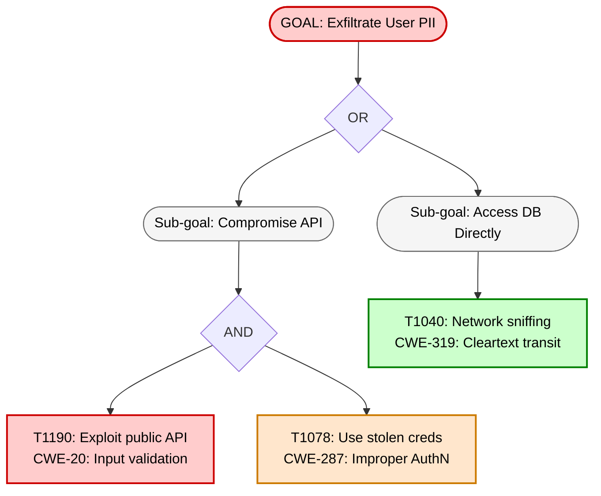
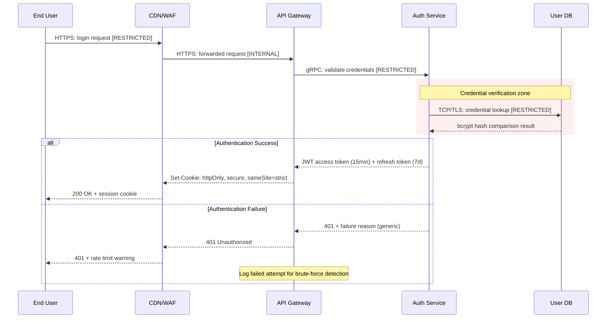

```mermaid
flowchart LR
    %% Version: 2025-01-15 | Phase: 1 | System: ExampleApp | Type: Data Lifecycle | Asset: User PII
    Create(["CREATE\nUser registration form"])
    Process(["PROCESS\nValidation + enrichment"])
    Store[("STORE\nPostgreSQL · AES-256\nRetention: 7yr")]
    Archive[("ARCHIVE\nS3 Glacier · SSE-KMS\nRetention: 10yr")]
    Delete(["DELETE\nCrypto-shred + audit log"])

    Create -->|"HTTPS [RESTRICTED] [ENC]"| Process
    Process -->|"TCP/TLS [RESTRICTED] [ENC]"| Store
    Store -->|"[ASYNC] S3 API [RESTRICTED] [ENC]"| Archive
    Archive -->|"[ADMIN] deletion job [RESTRICTED]"| Delete

    classDef neutral fill:#f5f5f5,stroke:#666,stroke-width:1px,color:#000
    classDef dataStore fill:#e2e3e5,stroke:#383d41,stroke-width:1px,color:#000
```

# Companion Diagram Types

Defines diagram types that complement the primary DFD layers: attack trees, authentication sequences, and data lifecycle diagrams. Each has a specific producing phase, consuming phases, and output filename convention.

**Prerequisite**: Read [mermaid-spec.md](mermaid-spec.md) for symbol taxonomy (§3) and classDef reference (§8).

---

## §1 Overview

Companion diagrams supplement the 4-layer DFD with focused views of specific security concerns. They are NOT replacements for the DFD layers — they are additional artifacts.

| Diagram Type | Mermaid Type | Producing Phase | Consuming Phases | Required? |
|-------------|-------------|-----------------|------------------|-----------|
| Attack Tree | `flowchart TD` | Phase 5 (False Negative Hunting) | Phase 6, Phase 7, Phase 8 | Yes (for ≥3 kill chains) |
| Auth Sequence | `sequenceDiagram` | Phase 3 (Threat Identification) | Phase 6, Phase 7, Phase 8 | Yes (if system has AuthN/AuthZ) |
| Data Lifecycle | `flowchart LR` | Phase 1 (Reconnaissance) | Phase 3, Phase 7, Phase 8 | Optional |

---

## §2 Attack Tree

**Purpose**: Visualize attacker goals, sub-goals, and techniques in a hierarchical tree. Used during Phase 5 to trace kill chains and identify coverage gaps.

**Mermaid type**: `flowchart TD` (top-down hierarchy)

**Structure**:
- **Root node**: Attacker's ultimate goal (e.g., "Exfiltrate User PII")
- **Sub-goal nodes**: Intermediate objectives required to reach the goal
- **Technique nodes**: Specific attack techniques (leaf nodes)
- **AND/OR gates**: Use diamond nodes to show logical relationships
- **Feasibility coloring**: Color technique nodes by feasibility

**Conventions**:
- Goal nodes: `([Text])` stadium shape, `:::highRisk` if achievable
- Sub-goal nodes: `([Text])` stadium shape, `:::neutral`
- Technique nodes: `[Text]` rectangle, colored by feasibility
- AND gate: `{AND}` diamond — ALL children must succeed
- OR gate: `{OR}` diamond — ANY child can succeed
- Feasibility: `:::highRisk` = feasible now, `:::medRisk` = requires effort, `:::lowRisk` = difficult, `:::noFindings` = infeasible

**Output filename**: `{name}-attack-tree-{N}.mmd` (one per kill chain)

**Example**:


---

## §3 Auth Sequence

**Purpose**: Detail authentication and authorization flows showing success and failure paths, token exchanges, and session management. Used during Phase 3 to identify auth-specific threats.

**Mermaid type**: `sequenceDiagram`

**Conventions**:
- **Participant IDs** MUST match node IDs in the DFD (e.g., if the DFD has `API`, the sequence uses `participant API`)
- Show both **success path** (solid arrows) and **failure path** (dashed arrows with alt block)
- Annotate **token types** and **lifetimes** in message labels
- Use `Note over` for security-relevant observations
- Use `rect` blocks to highlight critical sections (e.g., credential transmission)

**Output filename**: `{name}-auth-sequence.mmd`

**Example**:


---

## §4 Data Lifecycle

**Purpose**: Trace data through its full lifecycle — creation, processing, storage, archival, and deletion — with classification and encryption annotations at each transition. Used during Phase 1 reconnaissance to build the data inventory.

**Mermaid type**: `flowchart LR` (left-to-right pipeline)

**Conventions**:
- **Stage nodes**: Use stadium shapes `([Stage])` for lifecycle stages
- **Data annotation**: Each transition edge shows classification + encryption state
- **Retention labels**: Include retention period in storage/archive node labels
- **Deletion method**: Annotate deletion node with method (soft delete, crypto-shred, physical)

**Output filename**: `{name}-data-lifecycle-{asset}.mmd` (one per major data asset)

**Example**:


---

## §5 Phase Integration

This table maps each companion diagram type to the phases that produce and consume it, and specifies the output file location.

| Diagram Type | Output Filename | Producing Phase | Primary Consumers | Included in Report? |
|-------------|----------------|-----------------|-------------------|-------------------|
| Attack Tree | `{name}-attack-tree-{N}.mmd` | Phase 5 | Phase 6 (validation), Phase 7 (overlay), Phase 8 (report) | Yes — Section VII (Findings) and Section XII (False Negative Results) |
| Auth Sequence | `{name}-auth-sequence.mmd` | Phase 3 | Phase 6 (validation), Phase 7 (overlay), Phase 8 (report) | Yes — Section III/IV (Diagrams) and Section VII (auth findings) |
| Data Lifecycle | `{name}-data-lifecycle-{asset}.mmd` | Phase 1 | Phase 3 (threats), Phase 7 (overlay), Phase 8 (report) | Yes — Section V (Asset Inventory) |

### Rendering Companion Diagrams

All companion diagrams are rendered to PNG using the same CLI command and config as the primary DFD layers (see mermaid-spec.md §2):

```bash
npx -y @mermaid-js/mermaid-cli \
  -i {file}.mmd \
  -o {file}.png \
  -c /path/to/references/mermaid-config.json \
  -w 3000 -b white --scale 2
```

Companion diagram PNGs are embedded in the consolidated report alongside the primary layer PNGs.
