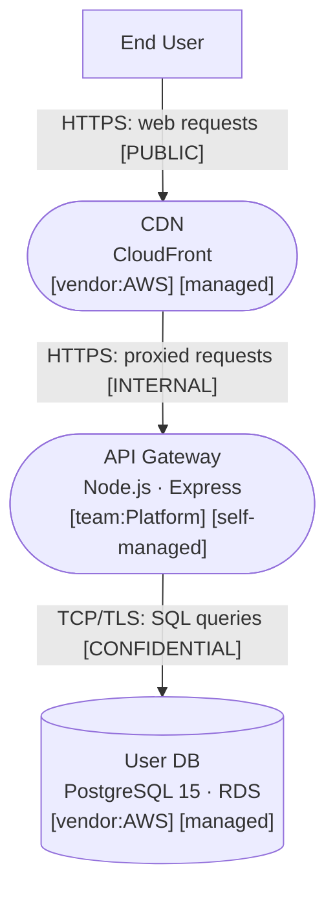
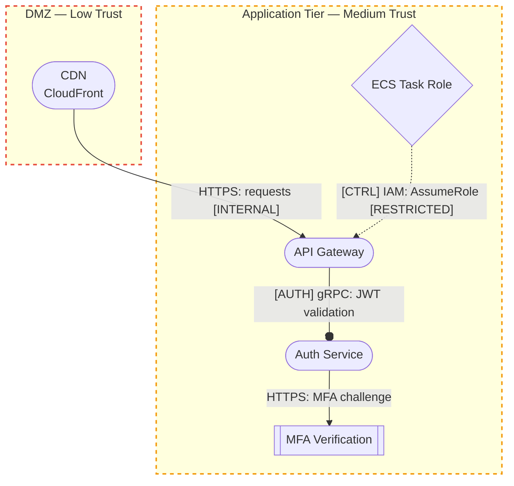
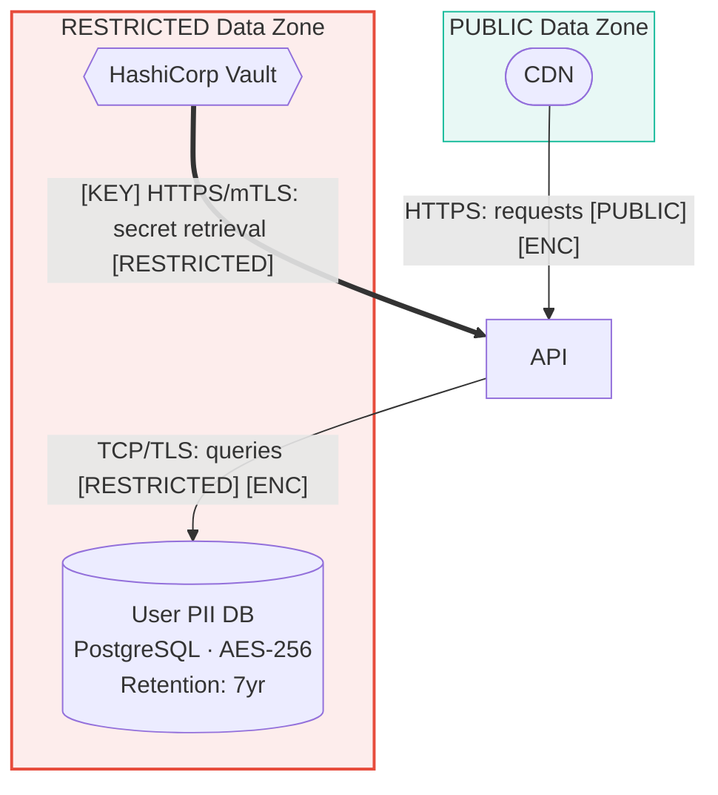
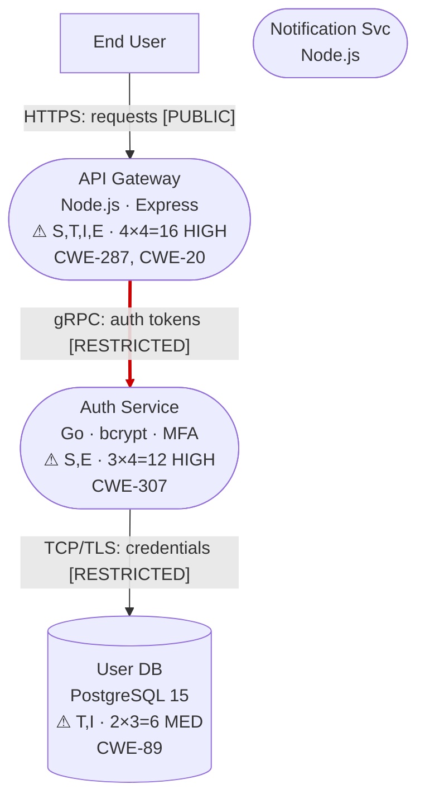

# Mermaid Diagram Layers

Defines the 4-layer separation of concerns for architecture diagrams. Each layer shows the same system through a different lens, preventing information overload and enabling phase-appropriate progressive disclosure.

**Prerequisite**: Read [mermaid-spec.md](mermaid-spec.md) for symbol taxonomy (§3), typed edges (§4), and classDef reference (§8).

---

## §1 Overview

Every assessed system is diagrammed in up to 4 layers. Each layer:
- Focuses on **one concern** (structure, identity, data, or threats).
- Is stored in **one `.mmd` file** per layer.
- Uses the **same node IDs** across layers so diagrams are cross-referenceable.
- Follows the filename convention: `{name}-L{N}-{layer}.mmd`

| Layer | Concern | Produced In | Consumed By |
|-------|---------|-------------|-------------|
| L1: Architecture | Components, topology, tech stack | Phase 2 | All phases |
| L2: Trust & Identity | Boundaries, principals, auth flows | Phase 2 | Phase 3, Phase 7 |
| L3: Data | Classification, encryption, retention | Phase 2 | Phase 3, Phase 7 |
| L4: Threat Overlay | Risk colors, annotations, attack paths | Phase 7 | Phase 8 |

---

## §2 L1: Architecture

**Purpose**: C4-level component diagram. No security judgments — just factual topology.

**Includes**:
- All processes, data stores, external entities from reconnaissance
- Tech stack metadata in node labels (Name + Technology + Version)
- Typed data flow edges (Data flow and Control/API types from §4)
- Network zone subgraphs with CIDR annotations (when known)
- Ownership markers (§7 of mermaid-spec.md)

**Excludes**:
- Trust boundaries (those go in L2)
- Data classification zones (those go in L3)
- Risk colors, threat annotations, attack paths (those go in L4)

**Applicable edge types**: Data flow (`-->`), Control/API (`-.->`), Build/Deploy (`-->` with `[BUILD]`)

**Output filename**: `{name}-L1-architecture.mmd`

**Mini-example**:

---

## §3 L2: Trust & Identity

**Purpose**: Overlay trust boundaries, authentication flows, and identity principals onto the architecture.

**Includes**:
- Trust boundary subgraphs (dashed, color-coded by trust level)
- Identity/IAM nodes (`:::identity`)
- Security control nodes (`:::control`)
- AuthN/AuthZ edges (`[AUTH]`) and Admin/Ops edges (`[ADMIN]`)
- Token and credential flows

**Excludes**:
- Data classification zones (L3)
- Risk colors, threat annotations (L4)

**Applicable edge types**: AuthN/AuthZ (`--o` with `[AUTH]`), Admin/Ops (`-.->` with `[ADMIN]`), Control/API (`-.->` with `[CTRL]`), plus all L1 edge types for context

**Output filename**: `{name}-L2-trust-identity.mmd`

**Mini-example**:

---

## §4 L3: Data

**Purpose**: Show data classification zones, encryption state at every transit point, key management flows, and data retention policies.

**Includes**:
- Data classification zone subgraphs (colored by sensitivity level)
- Encryption state on every edge (`[ENC]` / `[PLAIN]`)
- Secrets/KMS nodes (`:::secrets`)
- Key exchange edges (`[KEY]`)
- Data retention annotations in node labels

**Excludes**:
- Trust boundaries (L2)
- Risk colors, threat annotations (L4)

**Applicable edge types**: Secrets/Keys (`==>` with `[KEY]`), Replication (`-.->` with `[REPL]`), Async/Event (`-->` with `[ASYNC]`), plus Data flow for transit context

**Output filename**: `{name}-L3-data.mmd`

**Mini-example**:

---

## §5 L4: Threat Overlay

**Purpose**: Visualize validated risk assessment results on top of the architecture. Produced in Phase 7 after all analysis is complete.

**Includes**:
- Risk color coding on all nodes (`:::highRisk`, `:::medRisk`, `:::lowRisk`, `:::noFindings`)
- Machine-parseable threat annotations in enriched node labels (§5 of mermaid-spec.md)
- Attack path overlays using `==>` thick arrows with red `linkStyle`
- Risk-overlay legend
- All applicable elements from L1-L3 (trust boundaries, data zones, identity nodes, etc.)

**Excludes**: Nothing — this is the comprehensive view.

**Applicable edge types**: All 8 types, plus attack path overlays (`==>` with `linkStyle stroke:#cc0000`)

**Output filename**: `{name}-L4-threat-overlay.mmd`

**Mini-example**:

---

## §6 Scaling Rules

The number of layers produced depends on system complexity:

| System Size | Components | Layer Strategy |
|-------------|-----------|----------------|
| Small | ≤5 | **2-layer** permitted: L1 (structural) + L4 (threat overlay). L2/L3 content embedded in L1. |
| Medium | 6-20 | **Full 4-layer** required. One `.mmd` per layer. |
| Large | >20 | **4-layer + sub-diagrams**. Split by trust zone or functional domain. Each sub-domain gets its own 4-layer set. |

### Small System Exception

For systems with ≤5 components, a 2-layer approach is acceptable:
- **L1+L2+L3 combined**: One structural diagram with trust boundaries, data classification zones, and identity elements all included.
- **L4**: Separate threat overlay.
- Both use the same filename convention but with `-L1` and `-L4` suffixes.

### Large System Decomposition

For systems with >20 components:
1. Create a **top-level overview** diagram (≤15 nodes) showing major subsystems as single nodes.
2. Create **per-subsystem** 4-layer sets for each major subsystem.
3. Use consistent node IDs so cross-subsystem references resolve.
4. Add a `%% See also: {sibling}.mmd` comment in each file linking related diagrams.
