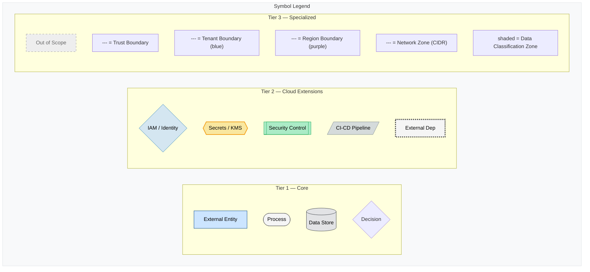
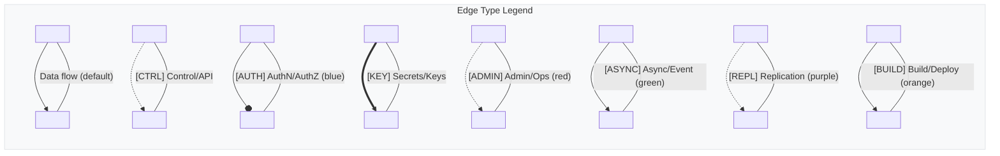
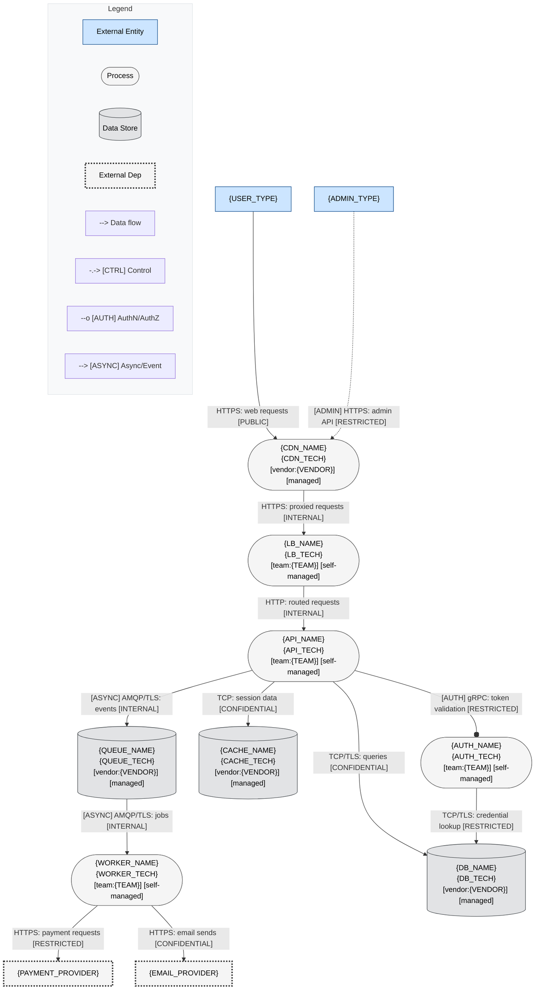
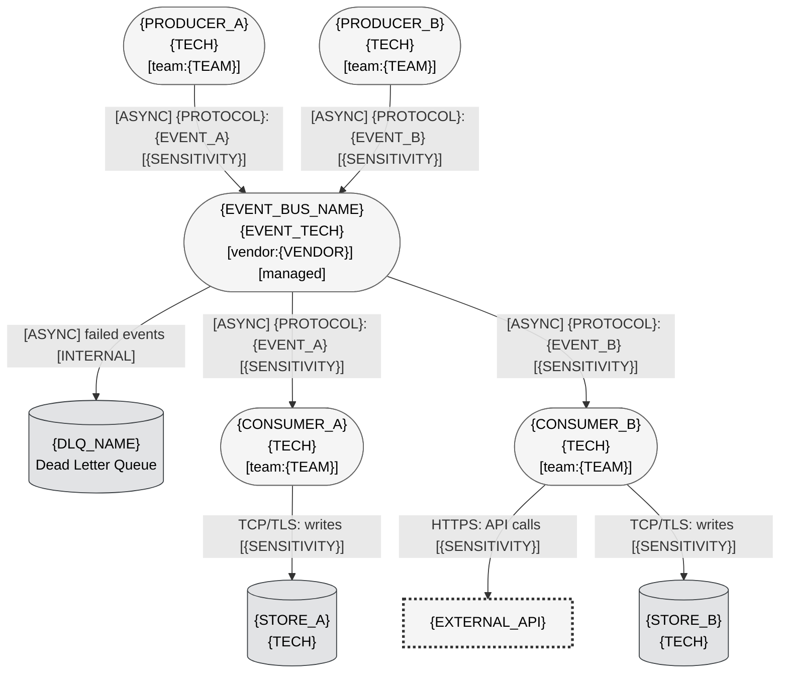
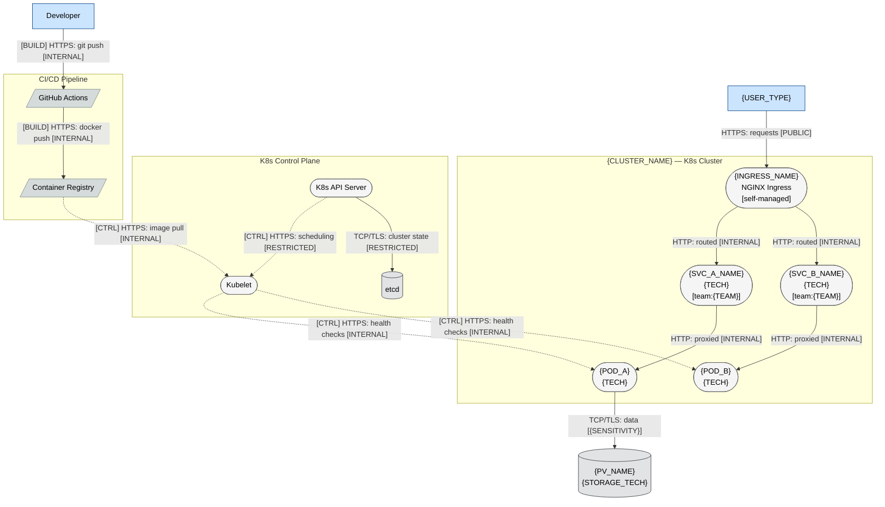

# Mermaid Diagram Templates

Copy-paste-ready templates for common architecture patterns. Each template includes all 4 layers with `{PLACEHOLDER}` markers for customization. Templates render as valid Mermaid out of the box.

**Prerequisites**: Read [mermaid-spec.md](mermaid-spec.md) for symbol taxonomy (§3), typed edges (§4), and classDef reference (§8). Read [mermaid-layers.md](mermaid-layers.md) for layer definitions.

---

## §1 Symbol Legend

Complete legend subgraph showing all 3 symbol tiers, all 8 edge types, and all risk classes. Include this (or a subset) at the bottom of every diagram.



---

## §2 Edge Legend

Standalone edge-typing legend. Include in diagrams that use multiple edge types.



---

## §3 SaaS Template

Standard SaaS architecture: User → CDN → LB → API → Auth → DB + Cache + Queue → Worker → External.

### L1: Architecture



### L4: Threat Overlay

```mermaid
flowchart TD
    %% Version: {DATE} | Phase: 7 | System: {SYSTEM_NAME} | Layer: L4
    User["{USER_TYPE}"]:::external
    Admin["{ADMIN_TYPE}"]:::external

    subgraph DMZ["DMZ — Low Trust"]
        style DMZ stroke:#e74c3c,stroke-width:2px,stroke-dasharray: 5 5
        CDN(["{CDN_NAME}\n{CDN_TECH}\n⚠ {STRIDE} · {L}×{I}={SCORE} {BAND}"]):::{RISK_CLASS}
        LB(["{LB_NAME}\n{LB_TECH}\n⚠ {STRIDE} · {L}×{I}={SCORE} {BAND}"]):::{RISK_CLASS}
    end

    subgraph AppTier["Application Tier — Medium Trust"]
        style AppTier stroke:#f39c12,stroke-width:2px,stroke-dasharray: 5 5
        API(["{API_NAME}\n{API_TECH}\n⚠ {STRIDE} · {L}×{I}={SCORE} {BAND}\n{CWE_IDS}"]):::{RISK_CLASS}
        Auth(["{AUTH_NAME}\n{AUTH_TECH}\n⚠ {STRIDE} · {L}×{I}={SCORE} {BAND}\n{CWE_IDS}"]):::{RISK_CLASS}
        Worker(["{WORKER_NAME}\n{WORKER_TECH}"]):::noFindings
    end

    subgraph DataTier["Data Tier — High Trust"]
        style DataTier stroke:#27ae60,stroke-width:2px,stroke-dasharray: 5 5
        DB[("{DB_NAME}\n{DB_TECH}\n⚠ {STRIDE} · {L}×{I}={SCORE} {BAND}")]:::{RISK_CLASS}
        Cache[("{CACHE_NAME}")]:::noFindings
        Queue[("{QUEUE_NAME}")]:::noFindings
    end

    User -->|"HTTPS: requests [PUBLIC]"| CDN
    CDN -->|"HTTPS: proxied [INTERNAL]"| LB
    LB -->|"HTTP: routed [INTERNAL]"| API
    API ==>|"[AUTH] gRPC: tokens [RESTRICTED]"| Auth
    Auth ==>|"TCP/TLS: credentials [RESTRICTED]"| DB

    subgraph Legend
        style Legend fill:#f8f9fa,stroke:#dee2e6
        RL1[External]:::external
        RL2([High Risk]):::highRisk
        RL3([Medium Risk]):::medRisk
        RL4([Low Risk]):::lowRisk
        RL5([No Findings]):::noFindings
        RL6["==> Attack Path (red)"]
        RL7["--- Trust Boundary"]
    end

    classDef highRisk fill:#ffcccc,stroke:#cc0000,stroke-width:2px,color:#000
    classDef medRisk fill:#ffe6cc,stroke:#cc7a00,stroke-width:2px,color:#000
    classDef lowRisk fill:#ccffcc,stroke:#008000,stroke-width:2px,color:#000
    classDef noFindings fill:#f5f5f5,stroke:#666,stroke-width:1px,color:#000
    classDef external fill:#cce5ff,stroke:#004085,stroke-width:1px,color:#000
    classDef dataStore fill:#e2e3e5,stroke:#383d41,stroke-width:1px,color:#000
```

---

## §4 Event-Driven Template

Event-driven architecture: Producers → Event Bus → Consumers → Data Stores. Emphasizes `[ASYNC]` edges.

### L1: Architecture



---

## §5 K8s Template

Kubernetes architecture: Ingress → Services → Pods → PVs, K8s API → Kubelet → etcd. Emphasizes `[CTRL]` and `[BUILD]` edges.

### L1: Architecture


